# ENGR 301: Architectural Design and Proof-of-Concept

## 1. Introduction

One page overall introduction including sections 1.1 and 1.2 (ISO/IEC/IEEE 42010:2011(E) clause 5.2)

### Client

*Removed*

### 1.1 Purpose

The purpose of this system is to provide active control and gather telemetric data within the lower atmosphere using a solid-fuel rocket as defined by the customer. The system will resolve the issues associated with a passive control system, such as the effect on wind on rocket trajectory.

### 1.2 Scope

### The Avionics Component of the System should meet the Following Goals

* When the rocket moves, the system shall adjust the gimbal via a PID controller and control the rocket thrust vector accordingly.
* Every 3 seconds, telemetry (velocity, acceleration, GPS position, altitude, temperature) shall be collected by the system.
* When telemetry (as stated above) is collected, the system shall record it on the system's storage. This is to be finished before the next telemetry is given to be processed.
* When telemetry (as stated above) is collected, the system shall transmit the telemetry to the base station over a wireless channel and be successful before the next telemetry is given to be processed.
* The system shall be in a small physical form factor, such that is it smaller than the previous 2018 and 2019 rockets.
* The system shall be physically modular so that any part of the system can be easily replaced when damaged or becomes faulty without more than 10 minutes work.

### The Base Station Component of the System should meet the Following Goals

* The base station shall receive telemetry from the avionics package over a wireless channel whenever the avionics package sends data. The data contain no more than 5 errors when being transmitted.
* The base station shall be able to output all the data it receives and processes to the computer over a serial USB connection. This shall be in a format that is easily readable by humans.

The system will be used to actively control solid fueled rockets, and to record and transmit telemetry

### 1.3 Changes to Requirements

#### Old Requirements

```Old_Requirements
The avionics component of the system will:

- Actively control the rocket thrust vector using a gimbal
- Record telemetry including velocity, acceleration, GPS position and altitude
- Transmit live telemetry to base station over a wireless channel
- Have a compact form factor to allow for flexibility

The base station component of the system will:

- Receive telemetry from the avionics package over a wireless channel
- Output data to computer over serial USB connection

The system will be used to actively control solid fueled rockets, and to record and transmit telemetry
```

#### Reasons for Update

When copying over the scope from the previous assignment, it was discovered and agreed upon that the scope that we had initially written was not SMART enough. With this in mind, it was rewritten as stated in section 1.2 to have specific goals to meet for the rocket.

## 2. References

References to other documents or standards. Follow the IEEE Citation Reference scheme, available from the [IEEE website](https://ieee-dataport.org/sites/default/files/analysis/27/IEEE%20Citation%20Guidelines.pdf) (PDF; 20 KB). (1 page, longer if required)

[1] 	P. Kruchten, “Architectural Blueprints—The “4+1” ViewModel of Software Architecture,” IEEE Software, pp. 42-50, November 1995. 


Relevant Information:
http://www.aerospaceeducation.co.nz/gallery/Body%2BTubes%252FAirframes (34mm)
http://www.aerospaceeducation.co.nz/gallery/Parachutes?view=grid&order=name
https://apogeerockets.com/education/downloads/Newsletter149.pdf


## 3. Architecture

Describe your system's architecture according to ISO/IEC/IEEE 42010:2011(E), ISO/IEC/IEEE 12207, ISO/IEC/IEEE 15289 and ISO/IEC/IEEE 15288.

Note in particular the note to clause 5 of 42010:

_"The verb include when used in Clause 5 indicates that either the information is present in the architecture description or reference to that information is provided therein."_

This means that you should refer to information (e.g. risks, requirements, models) in this or other documents rather than repeat information.

### 3.1 Stakeholders

See ISO/IEC/IEEE 42010 clause 5.3 and ISO/IEC/IEEE 12207 clause 6.4.4.3(2) 2 pages

The key stakeholders and the concerns associated with each stakeholder are described below:

**Client:**

The main concerns of the client involve the requirements of the avionics and base station system, as well as the safe and legal operation of the rocket system during testing. 

**University Regulations:**

The School of Engineering and Computer Science at the University requires that all parameters of the project are both safe and legal. Furthermore, all guidelines set out by ECS must be adhered to throughout the entire project. 

**System Builders and Developers:**

The main concern of the builders are developers of the system is that the architecture of the system will reflect thier skills and abilities. This concern is will have a significant impact on decisions made when developing the system architecture.

**Rocketry Community (System Operators):**

The rocketry community are the intended end users of the system, so they have concerns regarding the operation, reliability, maintainability and procurement of the system.

**Launch Environment:**

The environment in which the rocket system is operated will often contain people or property that must be accounted for in the design and operation of the system.

**Civil Aviation Authority (CAA):**

The CAA has concerns regarding the safe and legal operation of a rocketry system in the New Zealand airspace.

**Radio Spectrum Management (RSM) New Zealand:**

RSM New Zealand has concerns regarding the safe and legal operation of the radio communication system before, during and after the flight of the rocket system.

#### 3.1.1 System Requirements 

A summary of the concerns associated with the requirements of the system, and the stakeholders of these concerns can be seen in the table below:

| Requirement                                               | Stakeholder(s)               |
|-----------------------------------------------------------|----------------------------|
| Avionics system should contain active control system, including a gimbal and PID controller | Client, rocketry community |
| Avionics system should contain a black box recording system | Client, rocketry community |
| Avionics system should have telemetry transmission capabilities | Client, rocketry community |
| The base station should have telemetry reception capabilities | Client, rocketry community |
| The base station and avionics system should allow for GPS assisted recovery | Client, rocketry community |
| The base station should be able to communicate and control the avionics system | Client, rocketry community |
| The system should be intuitive to install and operate | Client, rocketry community |
| The system must have a compact form factor (fit within 29mm airframe) and low weight | Client, rocketry community |
| The base station system should output telemetry to computer over serial USB connection | Client, rocketry community |
| The rocket system should be recoverable and reusable | Client, rocketry community |
| The rocket system must operate in a variety of environmental conditions | Client, rocketry community |
| The system should be developed within the budget constraints identified in the requirements document | Client, ECS |
| The system must be tested thoroughly to ensure it operates reliably and safely | Client, rocketry community, ECS, CAA, launch environment | 
| The system architecture shall be achievable to implement in the deadlines defined in the requirements document | System builders and developers, ECS |
| The system architecture is within the abilities of the team members to implement | System builders and developers, ECS |
| The system's software must have a logical structure with appropriate documentation | System builders and developer, client, rocketry community |
| Redundancy should be implemented into the system to ensure reliable operation | Client, rocketry community, system builders and developers, launch environment, CAA |

Further details on the specific requirements of the system can be found in the project_requirements.md file found in this repository. 

#### 3.1.2 Safety Concerns: 

| Concern                                                   | Stakeholder(s)          |
|-----------------------------------------------------------|-------------------------|
| The system should operate according to the regulations defined by the CAA in regards to unmanned air vehicles | CAA, ECS, client, launch environment, rocketry community |
| The radio communications portion of the system will operate within the frequencies and power limits as defined by RSM New Zealand | RSM New Zealand, client, rocketry community, launch environment, CAA, ECS |
| Operators of the system are safe at all times during the operation of the rocket system | Client, rocketry community, ECS, CAA, system builders and developers, launch environment | 
| The testing of the rocket system follows the health and safety defined in the project requirements document | ECS, client, system builders and developers |
| The risk of the rocket damaging property, or injuring a person is minimised | Client, rocketry community, ECS, CAA, system builders and designers, launch environment |

Further information on the safety aspects on this project can be found in the project requirements and safety plan documents.

### 3.2 Architectural Viewpoints
(1 page, 42010 5.4) 

Identify the architectural viewpoints you will use to present your system's architecture. Write one sentence to outline each viewpoint. Show which viewpoint frames which architectural concern.

The first five architectural view points to present the architecture of the system are based on Kruchten's 4+1 model [1],which mainly involves the software part of the system. These viewpoints mostly relate to the requirements-related concerns identified by the stakeholders. Additionally, they also address some safety concerns including testing and redundancy. 

**Logical:**
The logical viewpoint describes the functionality that the system will provide to end users. In this viewpoint (assuming an object oriented approach) the problem is broken down into smaller abstractions of the original problem. These abstractions form the objects/classes of the system. UML diagrams are used to represent the logical view; these show the logical layout of the software system. For this system, this functionality is broken down into the individual hardware components, each of which gives the system different functionality.

**Development:**
This viewpoint describes the system from the perspective of the programmer, and addresses concerns related with software management. This viewpoint focuses on the actual organisation of the software components in the development environment. The different 'layers' of the software system and the interface between these layers is defined. This viewpoint takes into account all aspects of development, including ease of development, software management and constraints imposed by the toolset or programming language [1]. For this project, the scale of the development is relatively small, but this viewpoint is necessary for the efficient development of the software nonetheless.

**Process:**
The process architecture viewpoint involves the run time behaviour of the system. This viewpoint considers the different system processes and how they communicate. It also considers concurrency and the performance of the system, both of which are important in the rocketry system, which has many processes occurring simultaneously. Furthermore, this viewpoint will address the communication between the avionics system and the base station, as well as the communication between the base station and a computer.

**Physical:**
This viewpoint mainly deals with the nonfunctional requirements of the *software* part of the system. It primarily considers the reliability and performance of the system. Furthermore, it considers the various elements of the system (base station, avionics system) and the processes and tasks performed by each. The software is mapped to the different parts of the physical system.

**Scenarios:**
The scenarios viewpoint is a collection of the most important use cases of the system. This viewpoint describes the interactions between different parts of the software system (including objects and processes), and provide a way to validate the systems performance. This is used as the starting point for testing the suitability of an architectural prototype.

The last two viewpoints deal with the architecture of the physical hardware, including the circuit and mechanical architecture of the system. 

**Circuit Architecture:**
The circuit architecture viewpoint considers the way the physical electronics of the system will be implemented. Block diagrams of the connections between the electronic components represent the physical connections between the different parts of the electronics system. Furthermore, this viewpoint considers interferences that may prevent the electronics system from operating correctly. This addresses many of the requirement concerns of the stakeholders of the project. 

**Hardware Architecture:**
This viewpoint considers the mechanical structure of the system, including the physical construction of the system, and the interconnection of the physical components. The architectural models consist of the sketches of the proposed design, as well as block diagrams of the connections between components. This viewpoint addresses concerns regarding the safety of the system, as well as the testing of the avionics and base station subsystems. 

### 4. Architectural Views

The system can be broken down into a series of architectural views, each view from a different viewpoint.

The majority of these viewpoints are taken from Kruchen's 4 + 1 model, with the addition of Circuit and Hardware Architecture.

### 4.1 Logical


*Figure 1: Class Diagram for the Avionics Package*

#### Goals of Each "Class"

* **Microcontroller**:
Within this section will be the "main" processing of the program. The main responsibilities of this section is to contain the main loop, which allows the program to run "constantly". This is due to the limitations that the programming language C has. This section should maintain the state of the system, determining whether it should be performing system initialisation tasks, testing tasks, launch sequence tasks, ignition, launch tasks and post launch tasks.
* **system_init**:
The main responsibility of this section is to contain the loop which will initialise the system. This means that it should ensure that all the hardware is connected. This should repeat itself until all the hardware is responsive, or until some timeout clause occurs.
* **test_init**:
The main responsibility of this section is to contain the tests that system_init and the microcontroller should use. These are to be called when the system is first started, or whenever the system is prompted to. These tests should determine whether a certain functionality is working or not. An example of this would be testing to see if the gps outputs appropriate data (if any).
* **launch_sequence**:
The main responsibility of this section is to contain the process of the pre-launch sequence. The tasks that it accomplishes include performing final checks to ensure everything is working, having a countdown, and having the ability to have the process aborted when the appropriate signal is sent and received.
* **ignition**:
The main responsibility of this section is to ignite the rocket. This should simply ensure that the system is ready to ignite the engine for the initial launch/parachute, and perform the apporpriate actions afterwards.
* **launch**:
The main responsibility of this section is to contain the loop of actions to do while the rocket is in a launch state. It should periodically handle the collection of data from the sensors, and handle the commands that are being called from system control.
* **post_launch**:
The main responsibility of this section is to contain the loop of actions to do when the rocket is in a "falling" state. It should periodically handle the collection of data from the sensors, determine when the parachute should be released or not and determine whether the rocket has landed. If the rocket has landed, it should activate the buzzer repetitively.
* **radio_module**:
The main responsibility of this section is to handle the radio communication of the system. This includes being able to send data to mission control, as well as receive commands from mission control to perform.
* **black_box_module**:
The main responsibility of this section is to handle the data-writing to the storage of the system. This includes being able structuring the data logs, printing out to specific directories/files, and printing the data given from the sensors and time counter.
* **gimbal**:
The main responsibility of this section is to handle the gimbal actions. It should be able to calculate the required adjustments that the gimbal needs to makes to stay straight, and apply the physical adjustments to the gimbal. This section should also contain the PID controller, and have all the fields ready to be manipulated to tune the PID controller.
* **Sensor**:
The main responsibility of this section is to handle the sensors In particular, all the sensors should be able to initialise themselves, record data, store data, and get the data entries from the stored data.
Within this section, there are 5 subparts:
    * {sensor_gps, sensor_barometer, sensor_temp, sensor_accelerometer}, which are the individual sensor handlers
    * {sensor_data}, which is how the sensor data will be stored and storing additional information (like timestamps).

### 4.2 Development

The development view is the system as viewed from the programmer’s perspective, and so is focused largely on software management. This includes all of the following:
- Code structure
- Version control management
- Testing methods
- Ensuring software consistency

Since this is a software developer-oriented viewpoint, the main stakeholders are the developers themselves, as well as any other groups that read or interact with the code (including the wider rocketry community, given that this project is open source). Since the integrity of the software system is key to the overall success of this project, it is also in the best interests of the client that the system works as intended.

**Code Structure**

A well-structured codebase, emphasising modularity, has a number of advantages for our system. First, it allows the different elements of the system to be added, removed or changed, without disrupting the function of any other parts of the system. Second, it makes debugging and adjusting individual modules easier, since changes made will not affect other parts of the code.

A system of this system is made up of individual, self-contained modules, each controlling one major function, or area of function. A diagram of the module structure for this system:

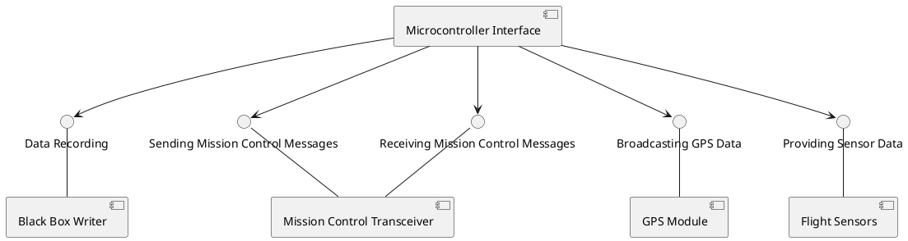

**Version Control Management**
 
Making effective use of the version control system (in this case, GitLab) is critical from a software development perspective. There are a number of version control features that are required in order to effectively develop a system of this scale.

First, issues, epics, milestones and boards are all tools used to control the direction and progress of development. These tools, used in tandem, allow members of the team to set goals and objectives, as well as prioritising the most important new changes to be made. This is hugely important for the software development process, as it makes sure elements are developed and updated in a sensible order. For example, modules that integrate or combine outputs from other modules, are most easy to develop once the other modules have already been completed, or at least have a skeleton implementation.

Branching is a tool that allows multiple current versions of the same repository to exist in the version control system at once. Since changes one developer is making may conflict with the changes that another developer is making simultaneously, branching is of critical importance to the software development cycle. By branching the codebase, the project can make progress in many different areas simultaneously without issue. Branching additionally means that all code can be thoroughly tested and vetted before being integrated into the master (deployment) codebase.

**Testing Methods**

Since elements of this system are both high-value and safety-critical, testing the software system to ensure stability and safety is hugely important. With this in mind, a number of steps must be taken in order to ensure that the code works at an appropriate standard.

First, code must be tested constantly through development against a substantial suite of standardised test cases, in order to ensure that it performs as required and expected in all possible situations. Ideally, this should include tests of every component in isolation, as well as integration between different components. This is a hugely important step to ensure that the codebase works as expected, and allows the codebase to be automatically tested thoroughly much more quickly than with a manual testing method. It also allows the scale of testing to grow indefinitely, providing increasingly more reassurance as the project approaches deployment. Additionally, having a testing suite like this allows code on a version control branch to be tested automatically before it is integrated into the master branch of the project.

One issue with developing an embedded system is that the functionality of the software system is entirely reliant on the hardware system that it is installed on. This is a major issue in testing because it means that it is impossible to guarantee the functionality of the codebase without integrating the hardware components being used into the testing process. As such, tests of the software running on the hardware are a necessity, both during development and to ensure functionality in deployment.

**Ensuring Software Consistency**

An internally consistent software system is critical for developers to be able to collaborate on a project of this scale. Developers must maintain a consistent, standardised, safe coding standard and style. If individual developers do not follow the same coding standards as the others, this may generate mismatches in readability or even functionality of the code. This can result in unintended, or unpredictable behaviour. Again, due to the high-value, safety-critical nature of this system, this is an unacceptable risk in this development environment. 

Another necessity for ensuring that the software system is internally consistent is intra-team communication as a part of the design process. Major changes to the design of the software system, including adding and removing components, or changing the functionality of existing components, must be discussed beforehand with the rest of the team. This is a cornerstone of the agile development model, and again shows the importance of proper communication in development.


We will be following the 

### 4.3 Process

The process section outlines the set of operations that must take place in order to reach an objective. These objectives may take the form of startup, configuration, launch or powering down the system. This Process section defines how the system is operated and how different parts of the system interact for the rocket to function correctly. As such, multiple software packages can interface with each other consecutively. Distributing the worload between different software packages can increase software modularity and allow distribution of labour more effectively..

There are three main dynamic aspects of the system that will be required. These include, but not limited to, the following components:

- Overall System Management System
- Sensor Data Collection System
- Main GNC (Guidance, Navigation and Control) System
- Logging System
- Data Transmission System

****

These software components make the system function as a whole through interfacing with each other at runtime. While they are executing consecutively, these individual components share the same set of hardware and flow data between each other to run the system effectively. The UML activity diagram below shows the avionics system onboard the rocket:

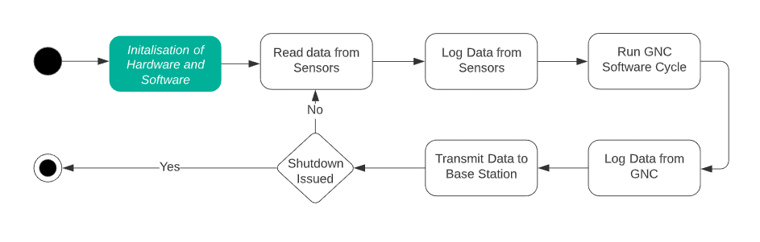

Each of the major events in the activity diagram above can be broken down further for more detail, these diagrams are shown below:

**Sensor Data Collection System**

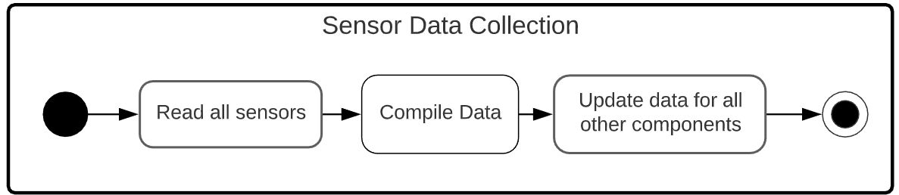

**Main GNC Software**

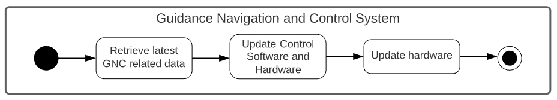

**Data Transmission System**

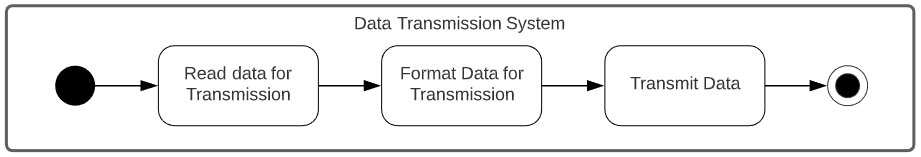

**Logging System**

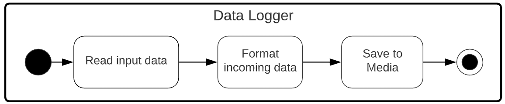

****

**Overall System Management Software**

This component manages the state space of the entire software system onboard the rocket. It is the first component operating during startup of the system, and the last operating component during shutdown. This component controls whats currently being run and it influences the flow of data between the various software components. The series of states used by the system are:

- System Initalisation
- Pre-Launch Idle State
- Launch Sequence
- Launch
- Post Launch

These states are used for synchronisation purposes of across the avionics package. This ensures that each individual component doesn't become out of sync with the rest of the system. If this does not occur, there is risk that one part of the system could conflict with another, potentially causing a failure.

**Sensor Data Collection Software**

The job of this software is to read all of the instrumentation and sensors on the rocket and process the data gathered. This data is then collated and forwarded to other processes such as GNC and logging. 

**Main GNC Software:**

The purpose of the Guidance Navigation and Control Software is to use the information from the sensors and instrumentation to adjust the control surfaces that allow appropriate navigation of the rocket. 

**Logging Software**

The logging software provides a means of storing information gathered from other parts of the avionics package. The data processed by the logger can be stored on Physical Media onboard the rocket in file form, or be sent to another software component for transmission to the base station wirelessly. The logging system should work based on a first in, first out system where data is logged in the order as it is received. This ordering is essential for data analysis and integrity.

**Data Transmission System**

The Data Transmission System's purpose is to operate the radio transceiver to transmit and receive data from the rocket. This allows a limited amount of data to be monitored remotely while the system is active. The data for transmission is generated by other components in the avionics package and is formatted and organised for transmission by a built in formatter. Due to limited bandwidth through the transmission system, the amount of data being sent may need to be reduced to simply essential information.

****

**Data Exchange**

For all the components of the avionics software package to function correctly, information from a number of sources must be able to be transferred between them. There a few different ways that information can be exchanged, such as message passing through method calls, shared memory and files.

- **Shared Memory:** Shared memory allows different components to access the same portion of memeory on a device. Two different software components can exchange information through this memory. Changes can be made to this memory by one component and read by another. Using shared memory generally performs well as data doesn't have to do through the kernal to reach other components.

- **Message Passing:** Message Passing is the simple transfer of messages between different sections of code through function calls, with some data as a parameter in the code.

- **Files:** Files can be used to allow different components to exchange information. One component might write to a file on the device, and another reads this information to be used. Files can be fairly slow as it takes time to write to physical media.


**Error Handling**

In the event of an error in flight, the rocket system will handle it appropriately in such a way that it does not cause further problems in another part of the system. If a failure occurs, it will need to be restricted to the immediate component and not be allowed to propagate through to other components.

 Errors will be logged through all logging routes, such that the base station knows it has occurred immediately. It will also be recorded on the physical media onboard the rocket with the complete logging data. Errors logs ideally will have a full log of the state of the component included to aid debugging after flight.


### 4.4 Physical 

The physical view shows the overall interaction between the separate hardware units of the overall system. The final system will have, at a minimum, two units; the avionics package aboard the rocket, and a base station for which it will communicate with. Minimal interaction will occur between the two; the avionics package is intended to operate in an almost entirely autonomous fashion.

#### Reliability and Scalability

The avionics package will gather telemetric data and control the flight of the rocket. The data gathered is to be sent to the base station in real time, but for redundancy, the data is also logged locally within the avionics package. At some point during flight, control signals will be sent from the base station. The potential for lost data is greatly reduced through both transmitting the data to the base station, and by logging locally. However, to further reduce the risk of losing data (particularly in transmission), additional base stations may be added.

#### Performance and Throughput

Performance of the system is restricted by the system's data transmission rate, sensor polling rate, and overall microcontroller processing speed. Of these, the polling rate of the sensors is liable to being the most limiting factor. The system is to poll and transmit data at the highest possible rate to attain the most data during the short flight duration.

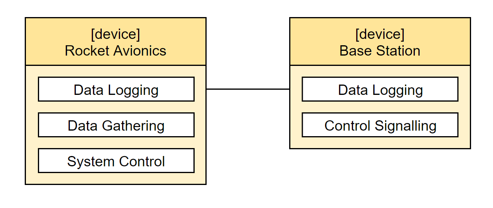

### 4.5 Hardware Architecture

### 4.6 Circuit Architecture

This section describes the main blocks of the hardware part of the system and how they will interact. This is achieved through the creation of block diagrams and schematics which give an overview of the components of the hardware of the system. These diagrams describe how the hardware requirements of the system will be met.

The system consists of two main components, the avionics system which is on board the rocket, and the base station which communicates with the rocket during flight.

#### 4.6.1 Avionics System

The avionics system electronics are responsible for the majority of the functionality of the system. This includes:

- Actively controlling rocket
- Recording sensory data
- Transmitting sensory data
- Recovery System deployment (parachute)
- GPS assisted recovery

Each of these requirements require one or more blocks in the circuit architecture to achieve. An explanation of the blocks required for each requirement follows.

##### 4.6.1.1.1 Active Control

Two main blocks are required for the active control of a model rocket - an accelerometer/gyrometer and a gimbal. The accelerometer and gyrometer relay the rockets acceleration and rotation to the control system, which allows it to compute which direction the rocket needs to fly. These signals are then relayed to the gimbal motors which adjust the position of the motor, and thus the direction of the rocket. Model rockets are highly dynamic systems, so the sensors, controller and gimbal need to be able to react quickly and accurately. This requires the selection of an IMU (inertial measurement unit, including accelerometer and gyrometer) with a fast refresh rate, high resolution and range. The LSM9DS1 was selected for this application because of its high performance, availability and easy interface. The gimbal motors were chosen to be 9G micro servos, as these have significant torque and a very low mass.

##### 4.6.1.1.2 Black Box Recording

The black box recording requires an onboard memory storage device. This device needs to have an acceptable data rate, while being convenient to recover data from. A micro SD module was chosen as it fulfils both these requirements, as well as being very common.

##### 4.6.1.1.3 Data Transmission

For remote data transmission to occur, a radio transceiver module is required that has suitable range for communication with the base station (>1km). An RFM95W module operating at 915MHz is chosen, as it has a very good range, availability, reliability and support. The module also meets the requirements set out by Radio Spectrum Management New Zealand, so it is able to be operated legally and safely. 

##### 4.6.1.1.4 Recovery System Deployment

The deployment of a recovery system is typically achieved by the burning of a fuse which ignites a charge that deploys a parachute. However, often these charges are not reliable, so it is good to have a backup to prevent the rocket from falling back to earth uninhibited. This requires MOSFETs which can act as switches to burn the fuse when the controller determines the rocket has reached the top of its flight. Furthermore, a reliable power source is required, as these fuses can require a significant amount of current. A lipo battery is perfect for this application, so it is the power source of the whole rocket. This requirement also needs a barometer which will allow the avionics system to know when to deploy the parachute. A BMP280 was chosen due to its low cost, high accuracy and library support.

##### 4.6.1.1.5 GPS Assisted Recovery

GPS assisted recovery requires a GPS module and an antenna which can determine the location of the rocket. Additionally, the use of the LoRa data transmission module is needed to send the location information back to the base station. The NEO-M8N GPS was selected to acheive this task, as it has adequate accuracy, availability and library support for the STM32 platform.
 
Note that when choosing the specific implementation of each block, the form factor was a key consideration. Model rockets tend to be quite narrow so the design of the avionics system must take this into consideration (the client has specified a maximum width of 29mm).

##### 4.6.1.2 Control System

All of the different blocks mentioned above need a microcontroller that can interact between the different blocks of the system. For the avionics system, an STM32F405RG microcontroller was selected to manage the interactions between the blocks. This microcontroller was chosen as it has sufficient processing power to implement a fast PID active control system, while simultaneously managing the other periphirals. Furthermore, it has the available periphrials needed to interface with all of the other components in the system. 

##### 4.6.1.3 Hardware Interfaces

Each block in the avionics system interfaces differently with the microcontroller, as outlined below:

- GPS: UART
- IMU: SPI1
- LoRa: SPI2
- SD: SDIO
- Barometer: I2C2
- Gimbal Servos: PWM
- Parachute Ignition: GPIO Out
- ARM_JTAG (for programming, debugging): ARM_JTAG

Below is a block diagram showing the connections between different parts of the system

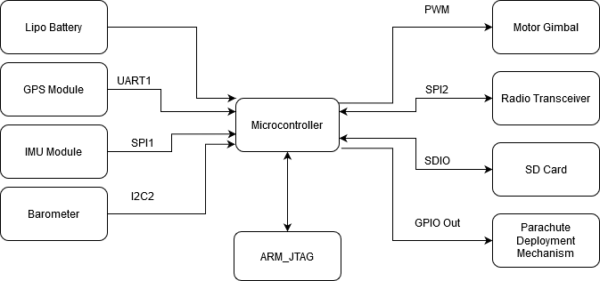

A more detailed description of the pin connections to the microcontroller can be seen in the avionics_system README.md.

In addition to the block diagram, a schematic of the initial design of the avionics system can be seen below. The intention of the design is to include all of the hardware components needed to meet all of the system requirements. This is because of time constraints, it is likely there will only be one hardware revision, so all hardware must be included.

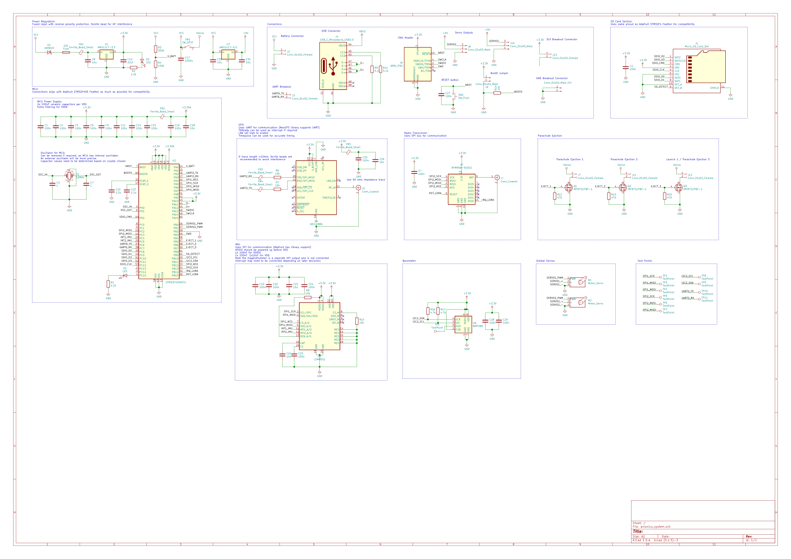

#### 4.6.2 Base Station

The base station is necessary to achieve the following requirements:

- Live telemetry transmission
- GPS assisted recovery
- Remote launch

Each of these requirement needs one or more circuit block to support it.

##### 4.6.2.1.1 Live Telemetry Transmission

The base station requires a radio transceiver matching that of the avionics system to allow the two devices to communicate. Additionally, a suitable high gain antenna is required to ensure the devices can communicate when the rocket is in flight, and if it lands far away from the base station.

##### 4.6.2.1.2 GPS Assisted Recovery

This requires the same blocks as the live telemetry transmission.

##### 4.6.2.1.2 Remote Launch

This requires the same blocks as the live telemetry transmission.

#### 4.6.2.2 Control System

In addition to the radio transceiver, the system requires a microcontroller to act as an interface between a computer and the radio transceiver. An Arduino Nano was chosen for this purpose, due to its simplicity, low cost and easy implementation. This microcontroller has significantly less power than that of the avionics system as it requires much less strenuous processing.

In addition to the microcontroller, a laptop or similar is required to display any of the information received by the base station.

#### 4.6.2.3 Hardware Interfaces

The hardware interfaces between the different blocks are as below:

- SPI: LoRa
- UART: Computer

A block diagram showing the interfaces between the different components can be seen below:

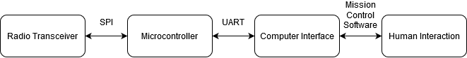

A schematic of the initial design of the base station can be seen below:
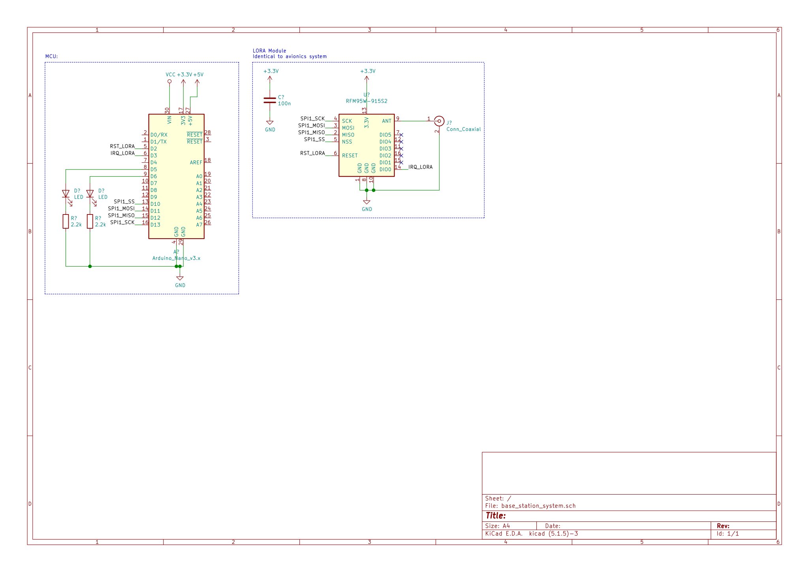


### 4.7 Scenarios

*Note: These scenarios are ordered as when these scenarios would actually occur while  using the rocket, rather than the importance of certain tasks*

#### Scenario 1: Installing/Testing the Hardware in the System

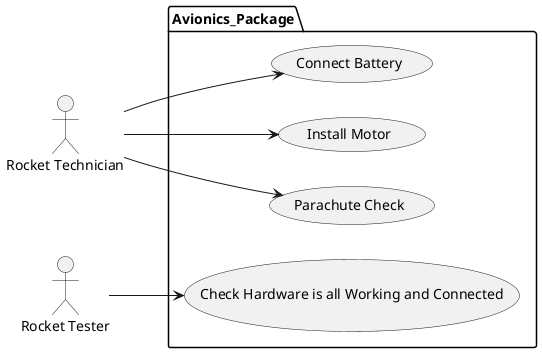

The scenario diagram above represents how the use cases and processes on how the rocket would be built, maintained, and repaired.

#### Scenario 2: Remote System Start Up

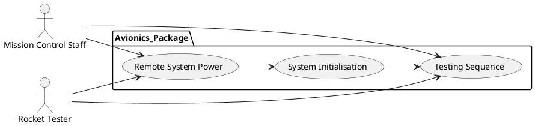

The scenario diagram above represents how the use cases and processes on how the rocket will be "initialised". This encapsulates both when this rocket is being tested in the lab, but also when it is being launched outside.

#### Scenario 3: Successful Launch of the Rocket  

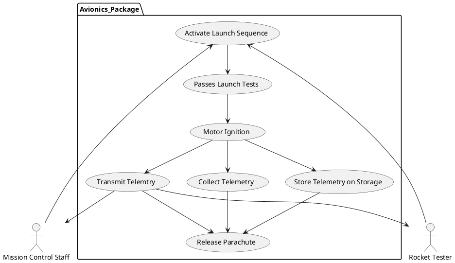

The scenario diagram above represents what a successful launch scenario would look like from start to finish. This scenario only considers the rocket's launch in a general point of view.

#### Scenario 4: Unsuccessful Launch of the Rocket - Abort during Launch Sequence

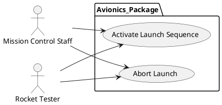

The scenario diagram above provides a simplified view of what the Mission Control Staff/Testers need to do in the case they need to abort the launch sequence. It is important to note that within this scenario, the rocket will not launch or ignite, and forcing the abort of the launch will only occur and register if pressed when the rocket is in the state of pre-launch idle.

#### Scenario 5: Unsuccessful Launch of the Rocket - Launch Sequence Failure

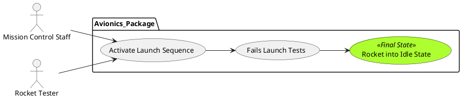

The scenario diagram above represents provides a simplified view of what occurs when the rocket determines within the launch sequence that it is not capable for flying for any reason.

#### Scenario 6: Unsuccessful Launch of the Rocket - Transmission Failure

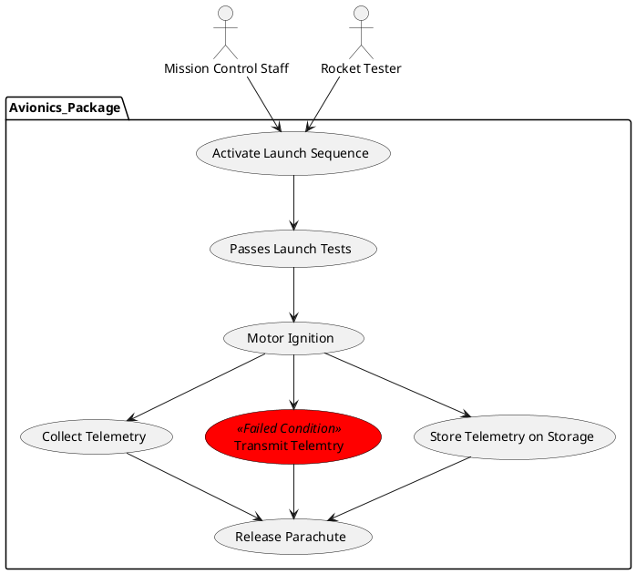

The scenario diagram above provides insight on what would happen if data would fail to transmit. As can be seen, the rocket will still perform all of its actions, as if it was still working. The only difference from this scenario and the successful scenario would be that the rocket would not be transmitting anything, and the telemtry must be collected through what got stored.

This scenario can be reflected also to the storaging the telemetry failing.

#### Scenario 7: Unsuccessful Launch of the Rocket - Parachute Failure

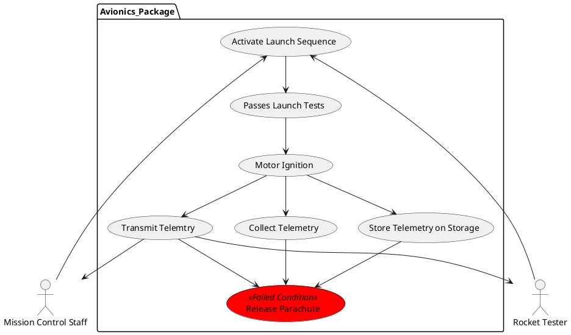

The scenario diagram above represents is similar to scenario 6, except that the failure here is when the parachute fails to deploy. There are several reasons that this could occur such as

* **Hardware locks do not unlock:**
 This would lead to the rocket's motor being unable to properly release the parachute, and causing the rocket to potentially fireball.
 We can account for this through peforming tests before launch ensuring that the hardware locks do release when expected.
* **Parachute gets stuck in the rocket while being released:**
 From this situation, the parachute will either be "partially" released, which would still allow for partial drag to still occur and slow the descent a little bit, even though not optimal. If the parachute would tear, then this will simply act like no parachute existed at all.
 We can account for this performing various tests in the lab to ensure the parachute is unable to get stuck, even with unoptimal conditions such as wind.

#### Scenario 8: Unsuccessful Launch of the Rocket - PID/Gimbal Failure

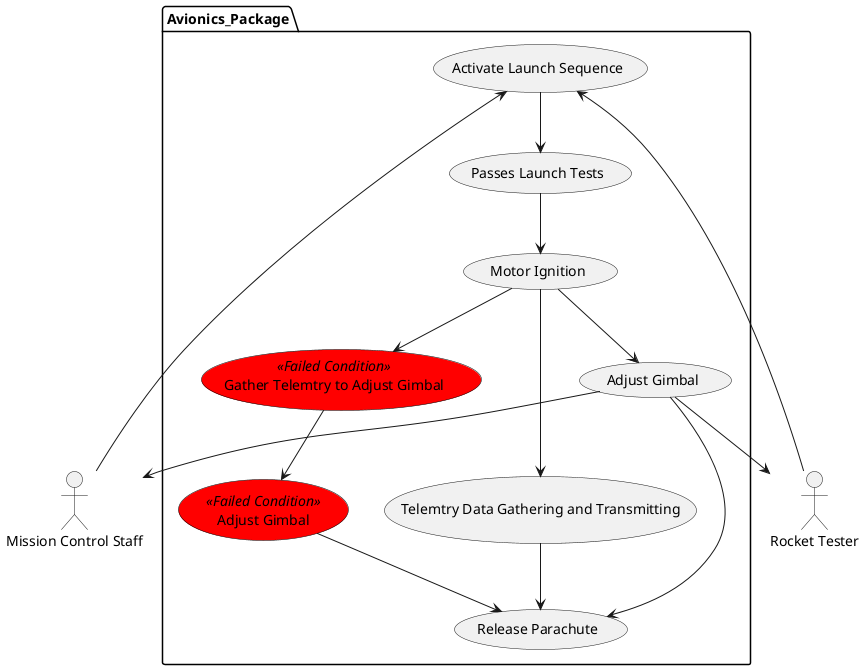

The scenario diagram above represents is similar to scenario 6, except that the failure here is when the parachute fails to deploy. There are several reasons that this could occur such as

#### Scenario 9: Successful Retrieval of the Rocket

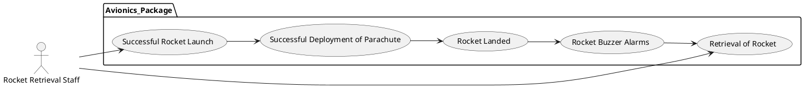

The scenario diagram represents the scenario when the rocket is retrieved successfully.

#### Scenario 10: Unsuccessful Retrieval of the Rocket - Rocket is Lost

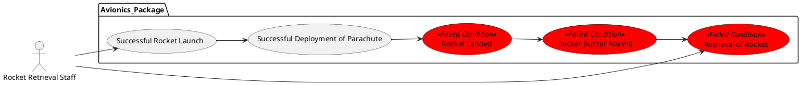

The scenario diagram represents the scenario when the rocket is not retrieved successfully. This can be for various different reasons, but in particular:

* **The Rocket landed poorly, due to the environment:**
 This is generally unavoidable, but can be mostly resolved through being in an area that is generally flat, and has as little obstructions like trees as possible.
* **The Rocket landed poorly, due to the wind pushing it away from the expected landing area:**
 Like the environment, this is generally unavoidable, but this can be somewhat resolved through having a large expected landing area, and only launching when the weather is good.
* **The Rocket buzzer fails to activate:**
 If the buzzer fails to activate, it is generally not too detrimental, as long as the rocket is tracked when it is falling.
* **The Rocket ignites/blows up when it lands:**
 This is hard to resolve, except through ensuring that all rocket itself is made in non-flammable materials, and that the rocket is retrieved with this consideration.

### 4.6 Hardware

The hardware architecture view addresses the concern of relating the hardware and software elements of the rocket system. This gives a broad overview of the system, and allows hardware and software integrators to work towards an outcome, given the perspective of how their elements are expected to contribute to the system as a whole.

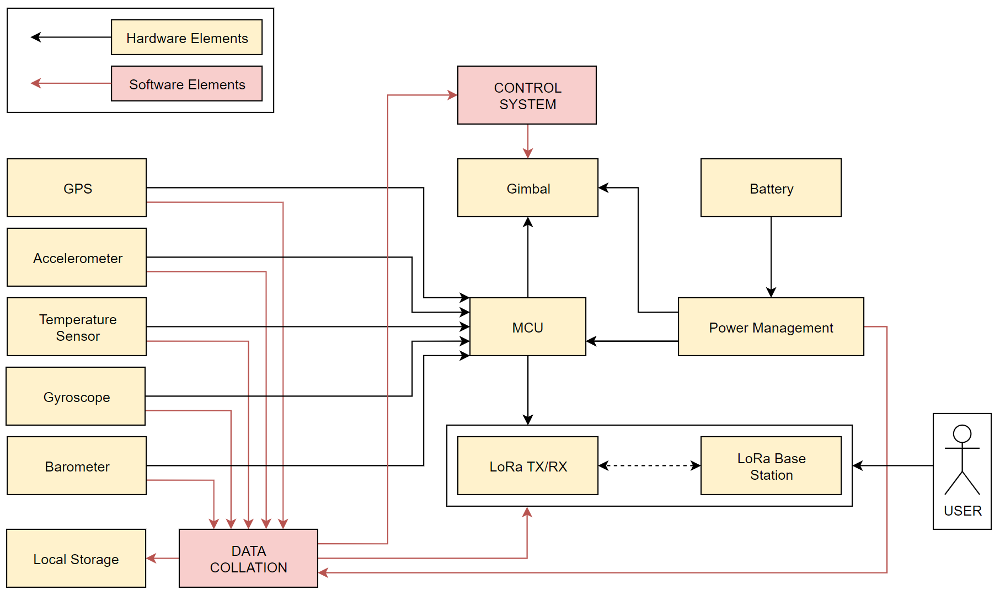

The system can be described by the following elements/subsystems, and their hardware-software relations.

#### Power Delivery

Power is necessary for the system to function as a whole, but has little relation to the software aspects of the system. This being said, measuring the voltage level of the system battery is necessary for determining launch suitability, and reporting to mission control. As such, the battery voltage level will be read by the microcontroller; this data will collated with other data, and sent through the LoRa wireless system to the receiving LoRa base-station. This summarizes the extent of software involvement with the power delivery subsystem.

With respect to the hardware itself, there is no necessity for dedicating charging circuitry, as charging of the battery can be done externally (with the battery separated from the rocket). A switching voltage regulator will be necessary to attain the higher voltages required for the gimbal's servo motors, and another for providing a stable voltage for the remaining circuitry. The battery itself only needs to be a small single cell lithium-polymer battery (nominal voltage of 3.7V)for the short flight duration.

#### Gimbal

The rocket gimbal will be comprised of 2 or 3 servo motors, depending on the design deemed most suitable at testing. Data related to the rocket's position and orientation will be collected from the gyroscope, accelerometer, and barometer. The position of the gimbal, which control's the direction of the rocket's thrust, must be adjusted with accordance to the positional data gathered. As such, a software control system will be implemented to bridge these two as necessary.

The servo motors of the gimbal will require at least a 5V supply, and draw the most current of all electronic components in the system. Thus, the power delivery system will have specialized power delivery circuitry specifically for the servo motors.

#### Wireless Communication

The wireless communication is foundational with respect to the physical architecture view, with regards to this view, it can be seen that there is a strong dependance on the software implementation. All of the collated telemetric and positional data is to be constantly transmitted using this physical interface, along with being logged to local on-board storage. User input is also transmitted using this wireless interface; software solutions must deal with incoming data as well.

#### Parachute System

The parachute system is essential to ensure the safe recovery of the rocket. In a nominal flight, the parachute is deployed at the peak altitude as the rocket begins to fall. This slows the descent of the rocket to lessen the impact as it lands.

The parachute is stored in the nosecone portion of the rocket during ascent. When altitude peaks, it will be jettisoned using a simple pyrotechnic system. During consultation with all members of the development team, it was decided that this option was better than a mechanical system for weight reduction reasons. The parachute would be pulled out from the rocket body by a cord attached to the nosecone, which seperates from the rocket body. The cord deploying the parachute will be attached to both the nosecone and remainder of the rocket body.

The pyrotechnic system used for parachute deployment is automatically controlled by the microcontroller running the avionics software. However, it can also be initiated through a command sent from the base station to the rocket in flight. This allows a flight operator to initiate parachute deployment in the event of a software failure where the software fails to recognise the rocket has reached apogee.


## 5. Development Schedule

```
_For each subsection, make clear what (if anything) has changed from the requirements document._ If unchanged, these sections should be copied over from the requirements document, not simply cross-referenced.

Schedules must be justified and supported by evidences; they must be either direct client requirements or direct consequences of client requirements. If the requirements document did not contain justifications or supporting evidences, then both must be provided here.
```

### 5.1 Schedule

*This is unchanged from the project requirements document at the current stage.*

#### Minimum Viable Product

* The minimum viable product is to be completed by the Monday 10th August 2020
* This time is based upon 2 points:
    * The approximate 1 months that the previous year's 2018 project handover document needed.
    * This gives an approximate 1 month to work on the project once Trimester 2 begins.
* The specified date is tentative due to the COVID-19 epidemic that may cause delays in areas in development (see 5.3 Risks and Mitigation Strategies).

#### Final Release / Further Releases

* The final release is to be completed by Friday 16th October 2020.
* This time is based upon 2 points:
    * The approximate 4 months that the previous year's 2018 project handover document needed.
    * This is the "specified" final day of teaching as per the "Key Dates" state as per of 15/05/2020
        * https://www.wgtn.ac.nz/students/study/dates
* The specified date is tentative due to the COVID-19 epidemic that may cause delays in areas in development (see 5.3 Risks and Mitigation Strategies).

### 5.2 Budget and Procurement

#### 5.2.1 Budget

Present a budget for the project (as a table), showing the amount of expenditure the project requires and the date(s) on which it will be incurred. Substantiate each budget item by reference to fulfilment of project goals (one paragraph per item).

(1 page). 

### 5.2 Budget

The tables below present the different components required to construct and test the final release of the system. All prices are in New Zealand Dollars, but are subject to change dependent on availability and market fluctuations. Similarly, the components required may change, subject to design or requirement changes.

#### 5.2.1 Rocket Assembly

| Item                      | Purpose                                                            | Cost (NZD)             | Supplier        |
|---------------------------|--------------------------------------------------------------------|------------------------|-----------------|
| Rocket Body               | The rocket body includes the body tube, nose cone and (possibly) stabilising fins. This component is the foundation upon which all other rocket parts are attached. | $40 | Aerospace Education |
| Recovery System           | The recovery system prevents the rocket from falling unhindered to the ground. It consists of a parachute and ejection system which deploys at the apogee of rocket flight. | $35 | Aerospace Education |
| Motor                     | Required to accelerate the rocket into the air during the flight. Typically C class rocket motors with an impulse of 9 Ns will be used. | $15 per launch | Client |
| Motor Gimbal              | The rocket assembly will include a rocket gimbal, which the avionics package will use to control the rocket's trajectory. The gimbal will likely consist of 3D printed parts in conjunction with servo motors. | $15 | ECS |
| Servos (x2) SER0039       | The servos will be part of the gimbal and will adjust the trust vector of the rocket  | $10.72 (each)| Digikey |

Total: $111.44

#### 5.2.2 Avionics System
| Item                      | Purpose                                                            | Cost (NZD)              | Supplier               |
|---------------------------|--------------------------------------------------------------------|-------------------------|------------------------|
| Printed Circuit Board     | The avionics system will use a PCB to connect together all of the individual electronic components. Using a PCB allows the design to be compact, simplifies the design, and decreases assembly time. | $35 | JLCPCB |
| MCU STM32F405RG           | The avionics system requires a microcontroller to communicate with the different sensors, and send/receive information from the base station. | $19.71 | Digikey |
| Radio Transceiver RFM95W-915S2 | A radio transceiver will allow the avionics system to wirelessly communicate with the base station. This will allow live telemetry to be sent from the rocket to the base station, and will allow the user to wirelessly control the rocket. | $13.81 | Digikey |
| Antenna | The radio transceiver requires an antenna to send the signal to the base station | $10 | Digikey |
| GPS Module MAX-M8N        | An onboard GPS module will allow the avionics system to send the rocket location to the user. This will allow the user to perform GPS assisted recovery of the rocket. | $37.76 | Digikey |
| Antenna (Patch)           | GPS will need an antenna to receive signal from satellites | $7.10 | Digikey | 
| IMU LSM9DS1               | An inertial measurement unit is required so that the active control system can determine if any adjustments need to be made to the flight path of the rocket. Furthermore, the IMU will provide valuable information in the case of rocket failure. | $12.16 | Digikey |
| Misc Passive Components   | The avionics system design will require several miscellaneous passive electronic components (resistors, capacitors, connectors) to function. | $25 | Digikey |
| SD Card Socket            | Hold the SD Card so the avionics system can write to it | $3 | Digikey |
| Memory Storage            | The avionics system requires a memory storage that can serve as a black box for the rocket (likely an SD card). This system will record information from the IMU and GPS module. | $10 |
| Battery (2S 800mAh)       | A power source is required to power all the components of the avionics system. | $26.95 | RC Hobbies NZ |
| BMP280 | Barometer (pressure sensor) which will be used to determine altitude of rocket | $6.26 | Digikey |

Total: $206.75

#### 5.2.3 Base Station
| Item                      | Purpose                                                            | Cost (NZD)              | Supplier               |
|---------------------------|--------------------------------------------------------------------|-------------------------|------------------------|
| Printed Circuit Board     | The main part of the base station system will be the PCB, which will hold all of the components, and will connect all of the different components | $10 | JLCPCB |
| Arduino Uno               | The microcontroller will serve as an interface between the radio transceiver and the computer and user. The microcontroller will process the information received from the avionics package, and then send this information to a computer/laptop. | $14.71| Digikey |
| Radio Transceiver RFM95W-915S2  | A radio transceiver will be used to send and receive information from the rocket. This will be especially important for GPS assisted recovery of the rocket. | $13.81 | Digikey |
| Antenna                   | The base station will required a high gain antenna to ensure a good connection between the avionics system and the rocket. This will allow the rocket to communicate at very high altitudes or when it has landed behind an obstruction. | $14 | Digikey |
| Misc Passive Components   | The base station design will require some passive components (resistors, capacitors, connectors) to operate correctly. These components will be on the PCB. | $15 | Digikey |

Total: $67.52

Overall Cost: $385.71

#### 5.2.2 Procurement

The tables below outline the which sources will be used to procure the hardware and software components required to build the system. 

##### 5.2.2.1 Hardware
| Item                          | Source                             | Explanation                                                                     |
|-------------------------------|------------------------------------|---------------------------------------------------------------------------------|
| Electronic Components         | Digi-Key or Jaycar [6] | Various electronic components, including voltage regulators, resistors, capacitors, connectors and sensors are vital to the operation of the avionics system and base station. These parts are to be procured through ECS technicians who use the distributors mentioned. | 
| PCB                           | PCBZone, PCB Way or JLCPCB         | A PCB is required to make the electrical connections between the different electroical components on the system. The PCB also provides physical support for different components of the system.
| Rocket Body, Recovery System  | Aerospace Education [7]            | Physical components including the body tube of the rocket and the recovery system will need to be purchased. These components form a core part of the rocket system. |
| 3D Printing                   | ECS Labs                           | Several parts including the motor gimbal and nose cone of the rocket will need to be printed. The motor gimbal will form a core part of the active control system which is the minimum viable product. |
| Manufacturing Equipment       | ECS Labs                           | Equipment such as soldering irons will be required to construct the rocket system. |
| Electronic Test Equipment     | ECS Labs                           | Test Equipment including power supply, multimeter and oscilloscope will be needed to assist in the testing of the avionics package and base station. |

##### 5.2.2.2 Software
 Item                          | Source                     | Explanation                                                                     |
|------------------------------|----------------------------|---------------------------------------------------------------------------------|
| KiCad                        | Online; KiCad [8]          | KiCad is an open source software for electronic design. This software is required to create schematics and the PCB for the avionics package and base station. |
| VS Code and Platform IO      | Online; Microsoft [9]      | Visual Studio code, along the the Platform IO ecosystem will be used to develop the software for the avionics system and base station. |
| Tiny GPS                     | Online; Arduiniana [10]    | TinyGPS++ is a library that parses NMEA sentences. This will be needed for reading data from the GPS part of the avionics system. |
| Onshape                      | Online; Onshape [11]       | Onshape is a CAD software that will be used to design the parts that need to be 3D printed. This includes the design of the motor gimbal and the nose cone of the rocket |
| Open Rocket Simulator        | Online; OpenRocket         | Open rocket is a model rocket simulator. This will be used to ensure the rocket that is designed will be stable in flight, and is not too heavy, unbalanced etc. |
| Arduino IDE                  | Online; arduino.cc         | An alternative development environment for the software of the system |
| SX12xx Arduino Library       | Online; arduino.cc         | Used to interface with the LoRa modules, which allows communication between avionics system and base station |
| LSM9DS1 Arduino Library      | Online; arduino.cc         | Used to interface with the IMU on the avionics package, which allows measurements of rocket parameters to be recorded |
| STM32duino                   | Online; arduino.cc         | Board manager for Arduino IDE which allows the Arduino ecosystem to be used for programming STM32F405 | 
| BMP280 Library               | Online; arduino.cc         | Used to interface with barometer on avionics system |


### 5.3 Risks

*This is unchanged from the project requirements document at the current stage.*


### 5.4 Health and Safety

#### 5.4.1 Safety Plans

The safety plan is currently its own document, found at:

[Current Safety Plan](project_requirement/health_and_safety_plan.md)

#### 5.4.2 Safety Plan Discussion

Assuming that the rocket is a solid fuel design, the safety plan requires additional approval from the HOS, since the project is risk level "High". Current iteration of the safety plan does not address an electric system. This requires further examination.

## 6. Appendices

*None*
