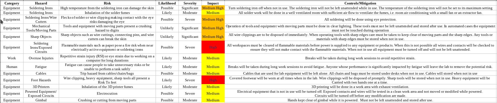

# Lab Safety Plan

*Last Update: 07/08/2020*

## Introduction

The aim of this document is to layout a Health and Safety Plan for the hardware development of the rocket.
The development of the rocket hardware poses several risks that need to be mitigated in order for the health and safety of not just the members in Group 2, but also any other personnel in the laboratory and/or in the wider building.

**This document will endeavour to:**

* Identify the risks present when working in a laboratory environment, and in particular when developing an avionics system for a rocket
* Identify the mitigating factors and controls that will reduce these risks identified above

This document will build on the general safety plan already specified by the laboratory rules to provide more specific guidelines to be followed by all members involved.

---

## Contents

1. **The Rocket**
2. **Risk Matrix**
3. **Control Plan**
    * *3.1:* Soldering Irons
    * *3.2:* Sharp Objects
    * *3.3:* Mechanical Tools
    * *3.4:* Moving Parts
    * *3.5:* Exposed Circuits
    * *3.6:* Overuse/Fatigue
    * *3.7:* Cables/Foot Hazards
    * *3.8:* 3D Printers
    * *3.9:* Powered Equipment
4. **Appendices**

---

## 1. The Rocket

The purpose of this project is to develop and test a rocket that is capable of making a controlled ascent. This document will address the risks associated with the development and testing of the rocket in a laboratory environment. There will be no testing of the rocket propulsion or parachute ejection in the laboratory, and as such this document will not address the risks relevant to those tests. The rocket will include a motorized gimbal, exposed circuits, and connecting wires and hence this document will address the risks associated with developing and testing these components.

---

## 2. Risk Matrix

---

## 3. Control Plan

This control plan will describe the implementation of the control factors described in the risk matrix and where to report incidents that do occur.

The term *'session'* is used to denote the duration of an activity, not the entire time spent in the laboratory.

It is important to note that the development of the rocket will occur in and only in CO249. This is to make sure that if any incidents occur, everyone will know where the problem has occurred and assist appropriately. 

### 3.1 Soldering Irons

Use of soldering irons carries some risks as listed in the risk matrix.

One designated team member will be assigned at the **start of each session** to be responsible for:

* Ensuring appropriate ventilation during operation.
* Ensuring the work station is clear of flammable materials.

During the operation, the user of the soldering iron should

* Check the temperature settings to confirm that it is not set too hot.
* Ensure that they are educated enough to be fully confident to use a soldering iron.

This team member will also be responsible at the **end of each session** to:

* Turn off the soldering iron at the end of each session.
* Ensure the soldering iron is not stored near flammable materials.

 All team members in proximity of the operation of the soldering iron must wear eye protection.

If someone suffers a burn from the iron, irritation from the fumes, or their eye is contacted by hot solder flecks an incident report will be filled in and sent to Roger Cliffe (ecs-safety@ecs.vuw.ac.nz) with a CC to Aaron Chen (aaron.chen@vuw.ac.nz) and Craig Anslow (craig.anslow@vuw.ac.nz).

### 3.2 Sharp Objects

Sharp objects that may be involved in the laboratory include wire cutters and wire clipping. What is written here applies to other sharp objects that may or may not be involved in the design and testing of the Rocket. In the case of sharp tools such as wire cutters, care will be taken to ensure digits are clear of the edge during use.

A team member will be assigned at the **start of a session** to:

* Ensure that any sharp tools are put away when not in use.

In the case of sharp debris such as wire clippings, the same or another team member will be assigned at the start of the session to:

* Dispose of the debris as soon as they are produced.

When doing any activities involving sharp objects, including cutting/stripping wires all team members in close proximity should wear safety glasses.

If someone suffers from an embedded object and/or bleeding, an incident report will be filled in and sent to Roger Cliffe (ecs-safety@ecs.vuw.ac.nz) with a CC to Aaron Chen (aaron.chen@vuw.ac.nz) and Craig Anslow (craig.anslow@vuw.ac.nz).

### 3.3 Mechanical Tools

Tools with moving parts that are operated manually will be done in clear lighting and care will be taken to keep digits clear of moving parts.

In the case of automated tools being used, a team member will be assigned to:

* Monitor the process entire process.
* Ensure that the automated tools are not touched by anyone while in operation.

If someone suffers from crushed digits an incident report will be filled in and sent to Roger Cliffe (ecs-safety@ecs.vuw.ac.nz) with a CC to Aaron Chen (aaron.chen@vuw.ac.nz) and Craig Anslow (craig.anslow@vuw.ac.nz).

### 3.4 Moving Parts

Moving parts of the Rocket include the motor controlled gimbal.

**Before any testing occurs**, a team member must be assigned to:

* Monitor the gimbal for the entire duration of the test.
* Ensure that any moving parts will not be touched by anyone until the test is complete and the power is removed.

If someone suffers from crushed digits an incident report will be filled in and sent to Roger Cliffe (ecs-safety@ecs.vuw.ac.nz) with a CC to Aaron Chen (aaron.chen@vuw.ac.nz) and Craig Anslow (craig.anslow@vuw.ac.nz).

### 3.5 Exposed Circuits

The avionics control system is controlled by different modules that have exposed contacts.

**At the beginning of a session** a team member will be assigned to:

* Clear the work area of flammable materials before the circuit is powered.
* Ensure that all parts that contain exposed contacts when powered on are not to be touched until they are turned off.

If someone suffers electrocution or burns an incident report will be filled in and sent to Roger Cliffe (ecs-safety@ecs.vuw.ac.nz) with a CC to Aaron Chen (aaron.chen@vuw.ac.nz) and Craig Anslow (craig.anslow@vuw.ac.nz).

### 3.6 Overuse/Fatigue

To avoid potential errors or injury resulting in overuse/fatigue, a team member will be assigned at the **start of a session** to:

* Keep track of the current time.
* Keep track the time that any one team member has been working for.

Should any team members work for over an hour without a break they will be asked to have a 5 minute break from any development.

If someone suffers from a repetitive strain injury or makes an error due to fatigue an incident report will be filled in and sent to Roger Cliffe (ecs-safety@ecs.vuw.ac.nz) with a CC to Aaron Chen (aaron.chen@vuw.ac.nz) and Craig Anslow (craig.anslow@vuw.ac.nz).

### 3.7 Cables/Foot Hazards

To avoid causing harm to any one self or another team member of laboratory personnel through tripping or any other foot hazards, a team member will be assigned at the **start of the session** to:

* Ensure that all the walkways in the laboratory are clear of tripping hazards on the floor.
* Tripping hazards include but are not limited to cables, bags, and chairs.
  
It is each team members responsibility to attend sessions wearing covered footwear.

If someone suffers from a fall or harms their foot an incident report will be filled in and sent to Roger Cliffe (ecs-safety@ecs.vuw.ac.nz) with a CC to Aaron Chen (aaron.chen@vuw.ac.nz) and Craig Anslow (craig.anslow@vuw.ac.nz).

### 3.8 3D Printers

To ensure that a 3D printer does not present a fire or health risk a team member will be assigned at the **start of a session** to:

* Ensure that the extraction ventilation is functioning properly.
* Monitor the 3D printer to ensure it does not catch fire.
* Confirm that the 3D printer is turned off at the end of the session.

If someone suffers from irritation from the fumes an incident report will be filled in and sent to Roger Cliffe (ecs-safety@ecs.vuw.ac.nz) with a CC to Aaron Chen (aaron.chen@vuw.ac.nz) and Craig Anslow (craig.anslow@vuw.ac.nz).

### 3.9 Powered Equipment

Powered Equipment refers to any equipment that supplies or is supplied electricity that was not previously referred to.

 **At the start of a session** a team member will be selected to:

* Ensure the equipment does not pose a fire risk by removing flammable materials from the work area.
* Ensure the contacts of the powered equipment are not to be modified/added/removed until turned off.
* Check that the equipment has been turned off at the end of a session.

If someone suffers from electrocution an incident report will be filled in and sent to Roger Cliffe (ecs-safety@ecs.vuw.ac.nz) with a CC to Aaron Chen (aaron.chen@vuw.ac.nz) and Craig Anslow (craig.anslow@vuw.ac.nz).

---

## 4. Appendices

*None Yet*
