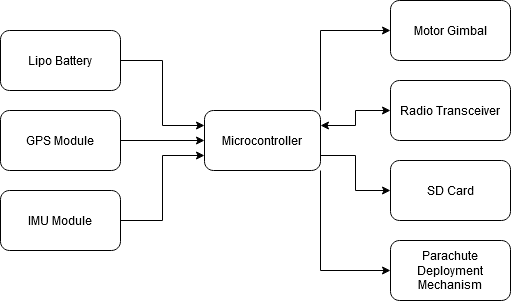
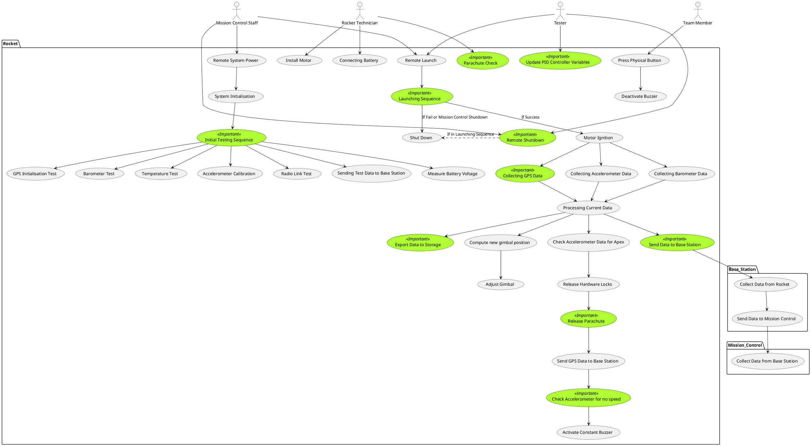
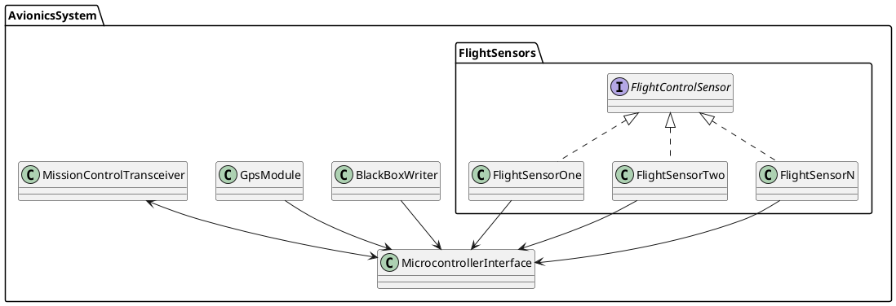

# ENGR 301 Project 2 Project Proposal and Requirements Document

## 1. Introduction

Amateur rocketry is a hobby that is popular throughout the world. These rockets are typically powered by off the shelf rocket motors which are available in a number of different classes. Smaller rockets will typically reach speeds up to Mach 1, and altitudes of 100-500m. These rockets are usually composed from lightweight materials such as wood, cardboard and plastic. Larger rockets can reach a speed several times the speed of sound, and an altitude of several kilometres. The larger rockets tend to be made from materials such as fibreglass and aluminium due to the larger forces exerted on the rocket body.

Most rockets have a passive control system consisting of fins which help to stabilise the rocket during flight. When implemented correctly, this method of controlling a rocket is simple and reliable, but it cannot correct for external disturbances. Wind is the main external disturbance that will effect the trajectory of a rocket, and the implementation of an active control system can negate the wind's effect on a rocket. Additionally, an active control system can make adjustments to correct for any imperfections in the construction of a rocket and motor. An active control system will necessarily make a rocket more complex and heavier, but it has the significant benefit of controlling the rockets trajectory precisely. A more accurate trajectory results in higher altitudes and more predictable landing zones, which are the main drawback of the traditional passive control system.

### Client

*Removed*

### 1.1 Purpose

The purpose of this system is to provide active control and gather telemetric data within the lower atmosphere using a solid-fuel rocket as defined by the customer. The system will resolve the issues associated with a passive control system, such as the effect on wind on rocket trajectory.

### 1.2 Scope

### The Avionics Component of the System should meet the Following Goals

- When the rocket moves, the system shall adjust the gimbal via a PID controller and control the rocket thrust vector accordingly.
- Every 3 seconds, telemetry (velocity, acceleration, GPS position, altitude, temperature) shall be collected by the system.
- When telemetry (as stated above) is collected, the system shall record it on the system's storage. This is to be finished before the next telemetry is given to be processed.
- When telemetry (as stated above) is collected, the system shall transmit the telemetry to the base station over a wireless channel and be successful before the next telemetry is given to be processed.
- The system shall be in a small physical form factor, such that is it smaller than the previous 2018 and 2019 rockets.
- The system shall be physically modular so that any part of the system can be easily replaced when damaged or becomes faulty without more than 10 minutes work.

### The Base Station Component of the System should meet the Following Goals

- The base station shall receive telemetry from the avionics package over a wireless channel whenever the avionics package sends data. The data contain no more than 5 errors when being transmitted.
- The base station shall be able to output all the data it receives and processes to the computer over a serial USB connection. This shall be in a format that is easily readable by humans.

The system will be used to actively control solid fueled rockets, and to record and transmit telemetry

### 1.3 System Overview

#### 1.3.1 System Context

Current amateur rocket designs use passive control systems with onboard telemetry to analyse a rocket's behaviour. The aim of the avionics system is to actively control the rocket to allow it to launch from many different situations, such as a high altitude balloon or a boat. The system will be able to account for non-ideal launch conditions such as high wind, making rocket launches easy and safe. Furthermore, the active control system will allow the user to modify the flight path of the rocket to account for the wind. This will allow a rocket to be easily recovered, and reduces the sizes of launch site required.

In addition to active control, the avionics package will record and transmit telemetry from the rocket to the base station, which will be connected to the user's computer. This allows the user to monitor the velocity, altitude and GPS location of rocket in real time. The real time GPS location data sent by the avionics system will allow the user to find the landing site of the rocket.

The block diagram below shows an overview of the required components in the avionics part of the system. The avionics system requires a microcontroller which will control all the other components in the subsystem. The inertial measurement unit (IMU), GPS module, battery and radio receiver are inputs into the microcontroller, while the motor gimbal, radio transmitter, SD card and parachute deployment mechanism are controlled by the microcontroller outputs.



The base station subsystem has the required components as defined in the block diagram below. The radio receiver will send data into the microcontroller, which will in turn send the data to the computer where it will be viewed by the user through a software interface. Similarly, a human will send control commands through the software interface, into the microcontroller which will then send this data to the avionics system through the base station's radio transmitter.


Both the avionics system onboard the rocket and base station will have a software component which will allow two-way communication. This software system will allow the transmission of commands to the rocket. It will also allow the transmission of some limited logging information and sensory readings to be sent in realtime back to the base station. This data can then be relayed to the mission control software.

#### 1.3.2 System functions

##### 1.3.2.1 Minimum Viable Product

The minimum viable product encompasses a solid-fuel or electric engine propelled rocket with active flight control and course correction; the product must be able to launch from a provided launch-pad and display autonomous control for the entirety of its flight, with flight termination occurring at the expenditure of fuel/power. The rocket's flight control scheme must incorporate an integrated control board and gimbal mount for the engine. An accelerometer should be used to provide feedback to control software, adjusting the engine's direction of thrust to correct, and maintain, controlled flight.

The final product will be extended to function beyond the minimum viable product, as below:

##### 1.3.2.2 Avionics Package

The main functions of the avionics system are outlined below:

- **Active Control System:** The main purpose of the avionics package is to actively control the rockets trajectory. The avionics system will be able to control the rockets trajectory through the use of servo motors which will adjust the thrust vector of the rocket engine. The avionics system will use the onboard telemetry data in conjunction with a PID control system to precisely control the path of the rocket. The user will be able to define the flight path of the rocket to account for external factors such as wind. The control system will be in charge of deploying a parachute (or similar) which will allow the rocket to gradually fall back to the earth. The control system will need to use the sensory data available to determine the optimal time to deploy the parachute.

- **Black Box Recording:** The avionics package will have on board storage (such as a micro SD card) which will store all of the relevant telemetry including altitude, velocity, location, air pressure and acceleration at frequent intervals. The data stored on the SD card will be formatted so that it can be easily imported into a spreadsheet software such as Excel for further analysis by the user. The system should be designed in such a way that if there is an abnormal event, data is available to determine the cause of the failure. This will involve ensuring the data will survive the abnormal event (such as a crash).

- **Telemetry Transmission:** The avionics package will have an onboard transceiver which will be capable of sending telemetry back to the base station in real time. This will allow the user to monitor the rocket's status during the flight. Additionally, the avionics will be capable of sending the location of the rocket back to the base station, which will allow the user to easily recover the rocket once it has landed. Furthermore, communication to the rocket from the user will be supported.

##### 1.3.2.3 Base Station

The main functions of the base station system are outline below:

- **Human Control:** The base station will contain a transceiver which will be capable of receiving data from the rocket, and transmitting data to the rocket. The transmission of data to the rocket will allow the user to control some of the rocket parameters, such as trajectory or telemetry recording frequency. The transmission system will also allow the user to remotely launch the rocket from the base station.

- **Telemetry Reception:**
The base station system will be able to receive live telemetry from the rocket through its radio transceiver. The base station will then forward this data through a serial USB connection to a computer in a format comma separated format. This will allow the mission control software to display a live feed of the rockets status (acceleration, velocity, altitude).

- **GPS Assisted Recovery:**
The telemetry reception capabilities of the base station will allow it to receive the current GPS location of the rocket. This will allow the user to perform GPS-assisted recoveries of a rocket. This will be essential for rocket recovery when the launch site is not an ideal location (e.g. lots of trees/hills). It is important that the rocket transmits this location data while it is flying, as it may not be able to receive a satellite signal once it has landed.

#### 1.3.3 User Characteristics

In accordance with the request of the client, all information associated with this project is open source, and is thus available to the wider rocketry community. Users are expected to have significant experience in the field of model rocketry, but the design does not assume experience with implementing an active control system within a rocket. This opens access to users looking to use this unit as a first time solution to adding an active control system to a rocket. For this reason, the avionics system and base station needs to be designed so that the installation process is simple for a beginner. Similarly, the documentation of both sub-systems should be thorough to assist a user in the installation and operation of the system. As the project is open source, some advanced users may wish to modify the system (schematic, PCB, source) to suit their specific requirements. This further enforces the need for thorough documentation to allow a user to make modifications easily. Typically, the avionics system and base station would be implemented in a model rocket, but few users may utilize the system for other applications. These users would be advanced users with a lot of technical expertise, so would need little guidance in the using the system in their unique application.  

Since model rockets are the primary intended application of this unit, experience in the field of model rocketry is required from users. This ensures the safety of the user, the environment and others. Specifically, users must be:

- Familiar with the processes involved in the safe launch and recovery of a model rocket
- Familiar with the CAA (Civil Aviation Authority) regulations, in particular the Part 101 rules for unmanned aircraft [1]
- Physically capable of operating a rocket with an avionics system in a safe way

Additionally, international users (not based in New Zealand) must ensure the frequency and power of the radio transceiver is allowed in their specific country, to ensure they follow regulations and do not interfere with other important signals

With these user constraints in mind, there are two main user groups that this unit is likely to be useful to:

- Model rocket hobbyists who are inexperienced with active control systems, seeking an all-encompassing solution to incorporate active control, black box recording and telemetry transmission systems into a rocket.
- Rocketry hobbyists or professionals who are more experienced with active control systems, looking for an active control solution that they can modify to suit their own needs, or iterate upon for community benefit.

#### 1.3.4 Limitations

##### 1.3.4.1 Regulatory Policies

**Radio Frequency Restrictions:** The system will be designed to comply with the radio frequency restrictions managed by the Radio Spectrum Management (RSM) unit of the Ministry of Business, Innovation and Employment (MBIE) in New Zealand [2]. Therefore, the system produced may not be suitable for use in other regions due to different radio frequency allocation. If users wish to implement this systems in other countries it will be their responsibility to ensure they comply with local radio frequency regulations.

**Aviation Authority Regulations:** The system is intended to actively control a model rocket. The system will be designed to comply with the CAA (Civil Aviation Authority) regulations in New Zealand for unmanned vehicles. The avionics and base station systems may not be compliant with the aviation regulations regarding unmanned vehicles in other countries. As a result, users in some regions may be unable to legally use the system.

##### 1.3.4.2 Hardware Limitations

**GPS Signal Strength:** The system is designed with the assumption that the area will have a sufficient number of GPS satellites that the GPS module can connect to. Some locations may have few satellites with sufficient power to be picked up by the GPS module, in which case it may not be possible to determined the location of the avionics system. The system will be designed to with the capabilities to pick up a GPS signal in Wellington. In locations where GPS signals are not easily obtained due to the environmental conditions (terrain, location) the GPS assisted recovery function will not be reliable. This issue could be mitigated by including a high gain antenna or amplifier in the system, but these measures will greatly increase the size and the weight of the system. For this reason, the system will be designed to suit the majority of applications.

**Radio Bandwidth/Range:** The bandwidth of the communications system that connects the base station and avionics system will differ depending on the signal strength and the distance between the base station and avionics system. For some launch locations, the geography of the surrounding area will have an effect on the strength of the signal. Similarly, some rockets may reach very high altitudes which necessarily increases the range between the base station and the avionics system. Extreme situations such as this may make the system unsuitable for some users. The user may need to make bandwidth compromises or modify the system to account to suit their individual needs.

##### 1.3.4.2 Safety Considerations

**Remote Launch Capabilities:** As avionics system will be capable of remote launch capabilities, the user will be able to wirelessly ignite the rocket motor from mission control. However, premature ignition of the rocket is an important safety consideration when designing a system with these capabilities. Therefore, the system must be designed with care to ensure there is a very low risk of premature ignition of the rocket motor. The system must have extensive documentation regarding the processes to follow when operating the remote launch system. Furthermore the system must be designed to minimise the risk of injury even if the system is operated incorrectly.

-------

## 2. References

References to other documents or standards. Follow the IEEE Citation  Reference scheme, available from the [IEEE website](https://www.ieee.org/) (please use the search box). (1 page, longer if required)

[1]  Civil Aviation Authority New Zealand, “Intro to Part 101 rules for unmanned aircraft,” May 2020. [Online]. Available: https://www.aviation.govt.nz/drones/rules-and-regulations-for-drones-in-new-zealand/part-101-rules-for-drones/. [Accessed 21 May 2020].

[2]  Radio Spectrum Management New Zealand, “Licensing in New Zealand | Radio Spectrum Management New Zealand,” May 2020. [Online]. Available: https://www.rsm.govt.nz/licensing/licensing-in-new-zealand/. [Accessed 15 May 2020].

[3]  Estes Rockets, “Estes_Engine_Chart,” 2020. [Online]. Available: https://estesrockets.com/wp-content/uploads/Educator/Estes_Engine_Chart.pdf. [Accessed 18 May 2020].

[4]  Estes Rockets, “Estes_2016_Catalog,” 2016. [Online]. Available: https://estesrockets.com/wp-content/uploads/Catalogs/Estes_2016_Catalog.pdf. [Accessed 14 May 2020].

[5]  Wikipedia and Various, “Altitude - Wikipedia,” 13 April 2020. [Online]. Available: https://en.wikipedia.org/wiki/Altitude#Temperature_profile. [Accessed 18 May 2020].

[6]  E. Technicians, “ECS BOM Requirements,” 2015 May 4. [Online]. Available: https://ecs.wgtn.ac.nz/foswiki/pub/Support/TechNoteAltiumDesignerTrainingFiles/ECS_BOM_and_PCB_Design_Requirements.pdf. [Accessed 22 May 2020].

[7]  Aerospace Education, “For all things Rocketry - Aerospace Education,” MYOB, 2020. [Online]. Available: http://www.aerospaceeducation.co.nz/. [Accessed 22 May 2020].

[8]  K. D. Team, “Download | KiCad EDA,” May 2020. [Online]. Available: https://kicad-pcb.org/download/. [Accessed 22 May 2020].

[9]  Microsoft, “Down Visual Studio Code,” 2020. [Online]. Available: https://code.visualstudio.com/download. [Accessed 21 May 2020].

[10]  M. Hart, “TinyGPS++ | Arduiniana,” 2020. [Online]. Available: http://arduiniana.org/libraries/tinygpsplus/. [Accessed 21 May 2020].

[11]  OnShape, “Onshape | Product Development Platform,” 2020. [Online]. Available: https://www.onshape.com/. [Accessed 20 May 2020].

---

## 3. Specific requirements  

### 3.1 External interfaces

#### 3.1.1 Primary Sensory Instruments

The sensory instruments report information about the physical unit’s condition during pre-launch sequences and flight. These measurements must include either measurements for, or information that can be used to calculate the following information about the unit:

- Global position/literal position
- Real time altitude
- Extrapolated velocity
- Current axial alignment

These components are all essential for nominal operation of the unit in flight.

The measurements are sampled from the sensors during unit operation and are provided as input to the software system for processing. The software system interprets these measurements into logical reaction control system (RCS) actions.

#### 3.1.2 Black Box Storage Media

The black box unit stores information about the flight of the rocket. It will record information about inputs and outputs relating to the sensing instruments, trajectory controls, as well as the ground team communication interface. Essentially, it should keep track of all inputs, input processing, and outputs, and record all of this information to some digital storage media.  

The black box recording device will accept input from the software system, to be recorded. This will consist of all raw inputs from other components, all processed data from other components, and all outputs being sent to other components. It will then write all of this data to a designated onboard storage medium, in a format that can be read easily later.

#### 3.1.3 Trajectory Controls

The rocket is to be propelled by a solid fuel rocket engine. As it stands, a fixed engine causes a rocket to become unstable during an extended flight time; in fact, the system may exhibit positive feedback, as the engine could further propel the rocket off-course. As such, the system requires control for the trajectory.

Commonly, this may be either a gimbal type system for manipulating the thrust from the solid fuel engine, or manipulatable external fins. Either way, the system will need some sort of motor outputs, which would be controlled by the system’s control board. Data related to the necessary adjustments would be collected by sensory instruments; the most notable data being axial position/alignment.

#### 3.1.4 Ground Team Communication Interface

While telemetric data collected by the system should be stored on board, some (or all) of the data should also be relayed to a ground control team in real time. Physically, a radio transmitter-receiver pair will be necessary.

A specific format for the telemetric data will have to be agreed upon between the systems and “mission control” teams. It is expected that the receiving side of the radio interface will use a standard serial interface. The control board for the rocket system will handle packaging and sending data through the transmission subsystem/module, taking the data from the sensory instruments.

### 3.2 Functions

#### 3.2.1 Use Case Diagram



#### 3.2.2 Launching Sequence

**What is the Goal of the use case?**  
The goal of the "Launch Sequence" use case is to ensure the rocket is ready to launch before it actually launches.

**Who benefits from the result of this use case?**  
Everyone who has worked on the rocket would benefit from this use case as it reduces the chance of an error occurring before launch.
The people who would most benefit from this would be the Mission Control staff that would be monitoring the launch.
This is because it allows them to check any issues before the ignition, and know with confidence that nothing unexpected will happen without their input.

**How will this use case be achieved?**  
This use case will be achieved through implementing some sort of countdown with several user confirmations via mission control to ensure everything is in check before ignition. This includes verifying all sensory data is nominal, and the GPS system has acquired a signal.

**How will we judge/measure that this use case has been taken into account?**  
We can ensure that this use case has been taken into account if the launch sequence occurs when the "remote launch" button has been pressed by Mission Control.

**What limitations are there to achieving the use case?**  

- This requires some sort of input from Mission Control, hence some integration with them to allow to send/receive data needs to be developed. This may take the form of an API that is agreed upon by this group and mission control.
- The launching sequence will also need to test every functionality of the rocket before being ready to launch, hence the completion of the launch sequence will only happen once every other aspect of the rocket has been finalised.

#### 3.2.3 Initial Testing Sequence

**What is the Goal of the use case?**  
The goal of the "Initial Testing Sequence" use case is to ensure that the rocket functionality works when the system is powered on.
For clarification, this is different to the launching sequence, since this is an "automated" process, rather than the manual process from the "Launch Sequence" use case.

**Who benefits from the result of this use case?**  
This use case benefits the Rocket Technicians the most, since it allows them to immediately know if anything is wrong with the system without the need to go through a test or an actual launch.

**How will this use case be achieved?**  
This use case will be achieved through having the system automatically go into this test sequence once the system initialises itself.

**How will we judge/measure that this use case has been taken into account?**  
We can judge that this use case has been taken to account if the initial test sequence runs on system initialisation.

**What limitations are there to achieving the use case?**  
The main limitation to this use case being implemented is that all the other functions of the rocket (eg. GPS data collection, barometer data collection, data processing) needs to be functioning correctly.

#### 3.2.4 Remote Shutdown

**What is the Goal of the use case?**  
The goal of the "Remote Shutdown" use case is to be able to stop the launch of the rocket before the "actual launch" of the rocket.

**Who benefits from the result of this use case?**  
Mission Control and any Rocket Testers of the system would benefit from the remote shutdown, since it gives them more control of the rocket. More control over the rocket is better for everyone, especially due to the volatility of engines. This will increase the safety factor associated with the rocket launch.

**How will this use case be achieved?**  
This use case will be achieved by allowing Mission Control or any Testers to be able to shutdown the system at any stage of the Launch Sequence. Within this stage, there will be several user prompts (see Use Case: Launch Sequence) which gives plenty of intervals for a check to occur if the "Remote Shutdown" has occurred.

**How will we judge/measure that this use case has been taken into account?**  
We can measure if this Use Case works as expected through the following process:

- Remove the ignition and the engine, so no premature ignitions can occur.
- At every possible stage during the Launch Sequence, attempt to shutdown the system remotely.
- If it does not shutdown during any phase of the Launch Sequence, then the system has failed. Conversely, if it shuts down at every possible stage, then the use case has been successfully taken into account.

**What limitations are there to achieving the use case?**  

- The launch sequence needs to be implemented before this use case can be tested/implemented.
  - The launch sequence also has its own dependencies, therefore the use case can only be implemented at the very end stages.

#### 3.2.5 Collecting GPS Data

**What is the Goal of the use case?**  
The goal of the "Collecting the GPS Data" use case is to collect the GPS data from the rocket during launch, or during test launches.

**Who benefits from the result of this use case?**  
This benefits the Mission Control staff, as well as any team member that will be tasked with retrieving the rocket. This helps the Mission Control staff since it allows them to be able to record and use this information. This use case helps the "rocket retrievers" find where the rocket is, as the GPS data will give an approximate location. It should be noted that this benefit is only realised if the use case "Send Data to Base Station", and all the use cases on that branch, are all working as intended.

**How will this use case be achieved?**  
This use case will be achieved by the GPS unit in the rocket send its data over to the microcontroller to process it. The micro controller will then need to send this data to the radio transceiver.

**How will we judge/measure that this use case has been taken into account?**  
We can judge if this use case has been taken into account only in conjunction with the use cases: "Processing Current Data" and "Export Data to Storage". If accurate GPS data is recorded on the storage, then we can make the assumption that the collection of GPS data has been a success.

**What limitations are there to achieving the use case?**  

- The physical GPS unit needs to be with the system builders, as different GPSs may provide different outputs that need to be accounted for.
- The expected location data needs to be retrieved from a known and accurate external source to compare with data obtained from tests.
- The system must be tested outdoors, with no geographical obstructions in order to obtain a GPS signal.

#### 3.2.6 Send Data to Base Station  

**What is the Goal of the use case?**  
The goal of the "Send Data to Base Station" use case is to send the processed and collated data from the rocket to the base station.

**Who benefits from the result of this use case?**  
The use case benefits only the Mission control staff, since the data will also be exported elsewhere (such as the rocket local storage).

**How will this use case be achieved?**  
This use case will be achieved through the use of the radio transmitter, which would transmit the data to the base station on a specific frequency.

**How will we judge/measure that this use case has been taken into account?**  

- We can judge if this use case works if the base station receives data from the rocket (testing in conjunction with use case "Receiving Data From Rocket"). This data must be received and be interpreted correctly, as it would show that the data has been transmitted correctly, even through possible interferences.
- The testing must also take into account interferences as this would better reflect the actual conditions that the rocket would be in.
  - This would mean that we need to test using walls, moving obstructions (such as people), and create other signals (like mobile calls and internet usage) while testing.

**What limitations are there to achieving the use case?**  

- The limitations of achieving this use case is that we would have to test this in conjunction of the "Receiving Data From Rocket" use case. This may create the issue that it would not always be clear on which part of the process is failing.
- The test will also need to take place outdoors to accurately reflect a rocket launch scenario

#### 3.2.7 Writing Data to Storage  

**What is the Goal of the use case?**  
The goal of the writing data to storage use case is to store the logging data on physical media onboard the rocket at all times.

**Who benefits from the result of this use case?**  
This benefits the Testers and Programmers of the avionics package as they will be able to review all data and logging after a flight has occurred. As wireless transmissions have a bandwidth cap and are potentially lossy, it is beneficial to store the logging data with 100% accuracy. This will allow us to see all readings from all instruments in file form after a flight has occurred. Additionally, in the event of a catastrophic failure, this may allow for analysis of what caused the failure.

**How will this use case be achieved?**  
This use case will be achieved through the reading of the instruments in real time and writing the readings and logs to the physical media, eg an SD card by the microcontroller.

**How will we judge/measure that this use case has been taken into account?**  
We check that this use case has been taken into account by being able to read the files recorded by the data recorder on another device after a flight, irrespective of flight outcome.

**What limitations are there to achieving the use case?**  

- The amount of information that the microcontroller can process each cycle may limit our chances of achieving success of this use case.
- The physical media needs to survive flight in order for logging data to be retrieved.

#### 3.2.8 Processing Current Data  

**What is the Goal of the use case?**  
The goal of the Processing Current Data use case is to process the data measurements, inputs and other signals into relevant outputs. This would be done by the microcontroller in the avionics system.

**Who benefits from the result of this use case?**  
Mission control operators benefit from the information processing as it allows them to see the rocket's flight information. The Testers also benefit from the processing of information as it's a prerequisite to the data being stored on physical media onboard the rocket, for later use in analysis and debugging. Additionally, the processing of data is essential for the operation of the active control system in the rocket.

**How will this use case be achieved?**  
This use case will be achieved through the use of the microcontroller to process the input signals from the sensors in the avionics package.

**How will we judge/measure that this use case has been taken into account?**  
We can look at other use cases' success to judge whether this has been taken into account, such as successful gimbal adjustment, and exporting to data to storage. If these other use cases are deemed successful, we can make the assumption that this use case has been successful as well.

**What limitations are there to achieving the use case?**  

- Processing power of the microcontroller in the avionics package.
- Interference with the signals before they reach the microcontroller.

#### 3.2.9 Compute New Gimbal Position  

**What is the Goal of the use case?**  
The goal of the "Compute New Gimbal Position" use case is to adjust the gimbal as a result of instrumentation readings interpreted by the microcontroller.

**Who benefits from the result of this use case?**  
Everybody involved with the launch of the rocket benefits, as it is important overall for the rocket to fly in the correct and predicted trajectory.

**How will this use case be achieved?**  
This use case will be achieved through the processing and control software calculating the angle adjustments required. These values will be used by the "Adjust Gimbal" use case to change the motors direction.

**How will we judge/measure that this use case has been taken into account?**  
We will be able to see the rocket follows the correct trajectory when it flies. Also, the telemetry collected during the rocket flight should indicate that the rocket has followed the intended path.

**What limitations are there to achieving the use case?**  

- All onboard sensors functioning correctly, with no interference.
- PID values are set accurately.
- The gimbal motors function reliably.

#### 3.2.10 Release Parachute  

**What is the Goal of the use case?**  
The goal of the "Release Parachute" use case is to release the parachute and slow down the descent of the rocket. This is done to avoid any damage to the rocket, as well as anything in the path of the rocket.

**Who benefits from the result of this use case?**  
The benefits is for everyone working on the rocket, as it avoids the loss of progress on the hardware side, while also ensuring the safety of everyone at the launch site. This also benefits others not directly involved in the launch as it prevents them from being injured by the rocket.

**How will this use case be achieved?**  
This use case would be achieved by the parachute being released from the rocket when told to do so. This would require having a proper check to know when the rocket is falling. This can be done by measuring the velocity of the rocket while it is flying. When the velocity decreases and begins to increase again, this would signal that the rocket has reached its apex of the flight, and is beginning to fall.

**How will we judge/measure that this use case has been taken into account?**  

- We can judge this use case is taken to account if the parachute is able to be released.
- We can ensure that the parachute is being released at the right time when the velocity of the rocket decreases and begins to increase again. At this point, the parachute should have been launched. If not, then we know that the release of the parachute has failed.
- We can be further ensure the parachute releases at the correct time by using barometer readings to show us when the rocket is starting to fall.

**What limitations are there to achieving the use case?**  

- This use case can only be achieved once the parachute and the nose cone has been installed (use case "Release Hardware Lock").
- Furthermore, if the use case "Check Accelerometer Data for Apex" is not implemented yet, then some code will need to be developed to test it in isolation.
- This system can only be properly tested in an actual launch of the rocket system

#### 3.2.11 Check Accelerometer for No Speed  

**What is the Goal of the use case?**  
The goal of the "Check Accelerometer for No Speed" use case is to check for lack of speed/velocity, therefore determining that the rocket is now landed, and needs to be picked up.

**Who benefits from the result of this use case?**  
The team members out on the launch site would benefit from this the most, as this check would then allow the buzzer to turn on. This buzzer in conjunction with the GPS data would allow for the quicker retrieval of the rocket post landing. Furthermore, if the rocket GPS data fails to transmit, this would be used as a failsafe to ensure the rocket can still be found.

**How will this use case be achieved?**  
This can be achieved by the microcontroller collecting the acceleration data throughout the launch, and therefore determining the rocket velocity. When the rocket velocity reaches zero, it will be able to pass on the message to other parts of the software to perform actions such as sounding the buzzer.

**How will we judge/measure that this use case has been taken into account?**  
This use case would be judged by whether the call is made when the rocket velocity is zero. This can be done by applying test data into the MCU, and analysing the reaction of the system when this case occurs.

**What limitations are there to achieving the use case?**  
The limitation of this use case would be that there would need to exist some way to input "launch" data into the system to test these circumstances.

#### 3.2.12 Check Parachute  

**What is the Goal of the use case?**  
The goal of the "Check Parachute" use case is to ensure that the parachute is ready to be released correctly when required by the avionics system.

**Who benefits from the result of this use case?**  
This check benefits everyone involved with the rocket, but especially the testers.

- It is a benefit to everyone, since if this check is not performed, then the launch could fail, and therefore inhibiting the progress on the development and management of the rocket.
- It is especially relevant to the testers, as they would not be able to test the parachute release functionality with a proper degree of certainty if the parachute does not work.

**How will this use case be achieved?**  
This use case will be achieved by a Rocket Technician checking the rocket whenever a launch (real or test) is about to occur.

**How will we judge/measure that this use case has been taken into account?**  
We can judge that this use case has been taken into account when it is performed before a launch or a parachute release test.

**What limitations are there to achieving the use case?**  
This use case will only be able to be tested given that the parachute and rocket head are constructed and are installed in the rocket.

#### 3.2.13 Updating PID Controller Variables  

**What is the Goal of the use case?**  
The goal of the "Updating PID Controller Variables" use case is update the PID controller variables, such that when the rocket is launched, the gimbal will act appropriately with the given inputs from the flight. These values should be obtained from simulations of the rocket launch.

**Who benefits from the result of this use case?**  
This check benefits everyone involved with the rocket, but especially the Rocket Technicians.

- It is a benefit to everyone, since if the rocket does not flight straight, it is unlikely that the rocket will have a successful launch.
- It is especially relevant to the Rocket Technicians, as being unable to adjust these values would disallow the chance for accurate gimbal adjustments.

**How will this use case be achieved?**  
This use case will be achieved by a Rocket Technician adjusting the variables of the PID controller in the software.

**How will we judge/measure that this use case has been taken into account?**  
We can judge whether the use case has been taken into account on whether it is accessible for the Rocket Technician adjusting the variables of the PID controller in the software.

**What limitations are there to achieving the use case?**  

- This use case requires the implementation of the PID Controller to be completed.
- The hardware must be functioning correctly. The onboard sensors must collect accurate data, and relay this to the microcontroller with minimal interference.

### 3.3 Usability Requirements

We need to consider these requirements through all the different scenarios:

- Pre-Launch Operations
- Launch
- Flight
- Retrieval

In order to properly assess the usability requirements, we have three metrics to assess our unit by. These are:

- Measurable Effectiveness, the ability of the unit to perform tasks to a quantifiable standard
- Efficiency, the ability of the unit to perform tasks without operational inefficiencies
- Satisfaction Criteria, qualitative standards that the unit must meet

For each of our use case scenarios, we can apply these three metrics to determine whether the unit meets the usability requirements.

**Pre-Launch Operations:** During Pre-Launch Operations, the unit is preparing to launch.

*Measurable Effectiveness:* For the unit to be considered effective, it must reach the launch phase without any issues. The following operations must be nominally performed, otherwise the launch process will be aborted.

- Hardware validation, including but not limited to: Sensor and input verification.
- Software state validation.
- Clearance from the Launch Director.

*Efficiency:* For the unit to be considered efficient during Pre-Launch Operations, the unit should complete checking in a sufficient time frame. This is essential as often only a small window is allocated for launch.

*Satisfaction Criteria:* The unit checks that launch requirements are satisfied, and moves into the Launch phase as expected without error.

**Launch:** We are defining the launch process as all of the time between first ignition of the propellant, and the rocket leaving the ground.

*Measurable Effectiveness:* In order for the unit to be effective in the launch phase, the rocket must release on its intended trajectory, with little to no measurable deviation.

*Efficiency:* The unit must conserve as much propellant as possible while still allowing the unit to launch effectively.

*Satisfaction Criteria:* The unit must initiate lift off, and transition into the flight phase as outlined in flight parameters with no additional interfacing by flight operators. The complete automation of this phase is essential.

**Flight:** Flight encompasses all the time the unit spends airborne. This includes all time from the initial launch to unit touchdown.

*Measurable effectiveness:* The unit should not deviate from its intended course, with real-time corrections made to the flight path in the event that external factors influence the unit’s trajectory. Once conditions demand it, a parachute should deploy to decrease the unit's velocity. During descent, the unit should remain intact and functional.

*Efficiency:* The unit should burn the optimal amount of propellant required to keep to the expected trajectory.

*Satisfaction Criteria:* The unit must follow its intended flight course, deploy the descent parachute, and make it to landing without any functional failure, or physical damage.

**Retrieval:** The retrieval phase is entered when the unit lands after flight, during this phase the unit should be retrieved by a flight operator for potential reuse in the future.

*Measurable Effectiveness:* The unit should land in a state that allows potential reuse in the future. Importantly, data must be undamaged by any potential impact.

*Efficiency:* The unit should have a sufficiently low power usage that it can be located using a GPS signal for a sufficient amount of time afterwards.

*Satisfaction Criteria:* The unit survives landing can be located, accounting for issues, by launch operators.

### 3.4 Performance requirements

To function correctly as expected by the customer, the rocket must perform to a certain standard. These performance requirements outline what the minimum expectations of the rocket are both physically and in software.

As the rocket is a real-time safety critical system, it must be able to react to measurement changes in effective real time; this is essential for the rocket to keep functioning nominally through all stages of flight. If the processing of measurement data is poor or slow, the rocket may not react fast enough to time sensitive events, e.g. sensory data being used for guidance control. This could lead to a minor, or catastrophic, failure of the rocket system. For a rocket control system to be suitable, it must efficiently process time-critical tasks and information.

The avionics should be able to perform without error through all stages of flight, withstanding the potentially changing forces, vibrations and potentially impacts. A model rocket typically experiences an acceleration of up to 10G during launch, so the avionics system needs to be designed to withstand such forces. Furthermore, at high altitudes the air temperature decreases at a rate of 9.8°C per kilometre; thus the avionics system must be designed to withstand low temperatures without failure. This may include considering different integrated circuit packages to suit low temperature environments.

To transmit telemetry data for the purpose of analysis and monitoring, the rocket shall be fitted with a wireless transmission system capable of data transmission through all the stages of flight. The system must have sufficient range for stable data transmission from the launch site altitude to apogee altitude. The transmission range must also be capable of reaching from the launch site to the location where the rocket lands under parachute, in order to transmit the GPS data so it can be found again. This range may vary because of wind conditions and the results of the rocket's flight performance, which will differ from flight to flight.

The bandwidth capacity of the radio telemetry system should be sufficient to transmit logging data from the rocket during flight to a receiving device such as a laptop. This data would be critical for failure analysis in the event of a failure that results in the loss of the rocket for any reason. Additionally, the avionics system must have an onboard storage system that can record data from the onboard sensors at the maximum possible data rate, to ensure useful telemetric data is obtained.

The software should be able to handle and continue even with unexpected and/or faulty readings coming from the various sensors during flight. Error checking and redundancy must be in place to ensure the safety systems are able to perform correctly.

### 3.5 Logical database requirements



#### Microcontroller Interface  

The Microcontroller Interface describes the core loop of the system and delegates most of the active tasks of the software system. It manages important events, such carrying out pre-launch system checks, as well as managing sequenced/regular events, such as data processing. The Microcontroller Interface is also responsible for polling all the sensor modules, and handles incoming data from those sensors, allowing course adjustments and data transmission back to mission control.

**Performs the Following:**  

- Run a constant time-linked loop, performing important events (eg. recording GPS data) at intervals
- Accept/request input from different sensors in the system
- Process input to determine commands for thrust control system
- Dispatch commands to thrust control system
- Handle commands from mission control, passed from the transceiver
- Handle any other incidental events

#### Black Box Writer  

The Black Box Writer class handles the writing to the avionics unit's "black box". The black box is a digital storage device that records all of the data relevant to each of the rocket's flights. This includes all inputs, outputs and processing going through the software system, as well as any error cases and logs. This class is passed data from other parts of the software system, to be formatted and recorded onto the digital storage device.

**Performs the Following:**  

- Accept packets asynchronously from other parts of the system
- Record the type and values of each packet, along with a system timestamp (eg, raw input from Sensor A with a value of 145.2)
- Save and output the data streams into their separate, respective files under a separate directory for each launch.

#### GPS Module  

The GPS Module class handles the action of receiving input from the GPS unit. Once it receives information from the GPS unit, it then reports that information back to the rest of the system to be sent to mission control via the transceiver. Since this information is not used for controlling the rocket while it is in flight, it should be handled separately from the flight control inputs.

**Performs the Following:**  

- Accept GPS location data from the hardware module
- Report this data to the rest of the software system

#### Mission Control Transceiver  

The Mission Control Transceiver class handles the actions of sending and receiving commands from mission control. The class would receive commands transmitted from mission control, and redirect it to the avionics system to be interpreted appropriately. Additionally, the class will also package and then transmit the data passed from the microcontroller interface back to mission control system.

**Performs the Following:**  

- Receive incoming command messages in a predetermined format from mission control
- Pass interpreted messages to the rest of the software system
- Accept messages to be transmitted to mission control, from the rest of the system
- Package and transmit the messages to mission control

#### Flight Control Sensors  

This is an interface for handling inputs from the rocket's various sensors while the rocket is in flight. It will convert the raw signals received from hardware components, and present sanitised inputs to the rest of the software system. Depending on the specific sensors used, there may be any number of implementations of this interface (one for each sensor).

**Performs the Following:**  

- Accept raw input from the sensor
- Transform raw input into workable data
- Sanitise the workable data to be safe.
- Report the sanitised workable data to the microcontroller interface.

### 3.6 Design constraints

The design constraints define limits, standards and specifications that the unit's software and hardware systems must adhere to. These constraints can be customer requirements, external standards, regulatory requirements or project limitations.

**Physical Properties of Rocket:**  
The rocket must adhere to the Civil Aviation Authority (CAA) regulations for model rockets, specifically Part 101 rules for unmanned aircraft. The regulations can be found at https://www.aviation.govt.nz/assets/rules/consolidations/Part_101_Consolidation.pdf.

The rocket must adhere to the following regulations:

- The rocket must weigh less than 1.5kg.
- The rocket's body components must be constructed of lightweight, non-metal parts.
- The rocket must use less than 125 grams of propellent.
- The rocket must use certified, commercially made rocket motors that have not been modified.
- The rocket must not produce more than 320 Newton seconds of impulse.
- The rocket must use a slow burning propellant.
- The rocket must be launched outdoors in ideal weather.
- The rocket must be launched remotely.

Both the CAA regulations and the customer require the rocket use a common type of rocket motor.

**Budget:** The rocket must be able to be produced within the limited budget provided.

**Reusability:** The customer expects that the rocket is able to be reused at least 10 times. This requires that the rocket uses parachutes to land safely, which are deployed at apogee. The rocket thus should be designed to withstand the forces, vibrations and potentially impacts of Launch, Flight and Landing with none or minimal damage.

The NZ Rocketry Association also state in their safety guidelines that a recovery system, such as a parachute, must be used so that the rocket safely returns to the ground.

**Open Source:** The software avionics package produced for the rocket must be released and licensed as open source for use by other members of the model rocket community. Hence, all dependencies must be open source, and the avionics package must adhere to all rules under their respective license(s) defined by the other open source dependencies used, if any.

**Radio Communication Systems:** All radio communication systems in the rocket must adhere to the relevant regulation including the Radiocommunications Act 1989 and the Radiocommunications Regulations 2001. The rocket must use a freely available frequency for communication to the base station. For the data to be relayed reliably the system shall operate on a frequency that has the least interference.

Relevant regulation and guidelines can be found through the following links:

- https://www.rsm.govt.nz/licensing/licensing-in-new-zealand/
- http://www.legislation.govt.nz/act/public/1989/0148/latest/DLM195576.html
- http://www.legislation.govt.nz/regulation/public/2001/0240/latest/DLM71513.html

### 3.7 Nonfunctional System Attributes

***The following are the relevant systemic requirements of the product:***  

- Time Behaviour
- Ease of Use
- Scalability for Distribution
- Withstanding flight and touchdown
- Recoverability
- Reusability
- Weight Constraints
- Testing
- Maintenance
- Motor and Propellant

**Time Behaviour:**  
The launch is the time critical phase of the rockets use. GPS information must be transmitted and the motor gimbal adjusted continuously throughout the flight, and the parachute must deploy as soon as the rocket descends. For this to be accomplished the avionics system will need to handle these simultaneous tasks without a queue of tasks building up. To ensure the most important events are prioritised, hardware interrupts may need to be implemented.

**Ease of Use:**  
Launching the rocket should be a streamlined process. Physical setup should consist of filling the propellant with minimal disassembly of the rocket before mounting the rocket on a launch pad. Specific instructions will be included for packing the parachute. Software set up should consist of a remote mission control system requesting access after a physical switch was been turned on. To assist in the ease of use, accurate and detailed supporting documentation needs to be produced.

**Scalability for Distribution:**  
Gimbal control should be able to scale up to larger rockets and motors with tuning. Additionally, system design should be well enough documented that it is reproducible by another team with no relation to development team. Furthermore, activities such as the process of tuning PID parameters should be documented to allow other user to apply this system to their application.

**Withstanding flight and touchdown:**  
All components used in flight must be able to function for the whole duration of the flight. To maintain the integrity of the rocket, the parachute must be reliably able to deploy after the rocket has reached the apex of its flight. Sensory and software components must survive touchdown, so that the rocket can be reused. Ensuring the black box data remains safe in the event of a failure is particularly important to ensure that the cause of the failure can be found. This may involve extra physical protections for the black box component of the system.

**Recoverability:**  
In the event of encountering an error pre-launch the rocket must enter an error state where it cannot launch. This error state will contain an error log so the issue can be reviewed. Any errors encountered in-flight should shut off the motor and deploy the parachute to avoid the rocket taking an unpredictable trajectory.

**Reusability:**  
The rocket must be able to be reused after a launch. This will require that the parachute system is able to safely return the rocket to the ground. The parachute and propellant will need to be replaced and the avionics system will need to be reset.

**Weight Constraints:**  
In order to be considered a model rocket the rocket must weigh less than 1.5kg (according to the NZ Rocketry Association). The weight is further restricted by the fact that Class C and D motors will be used, which allow a maximum weight of around 300g.

**Testing:**  
All states of the avionics system are to be tested that it can establish communications with mission control, enter error states safely, the gimbal control reacts safely, and that the parachute deploys reliably. This will ensure the safety of the user and people and object in the launch environment of the rocket.

**Maintenance:**  
The motor must be easily accessible and removable. All moving components must be checked for damage and cleaned before and after testing. The Parachute must be checked of tears and the strings checked for fraying. Additionally, the electrical connections between the components must be checked to ensure the avionics system will operate correctly.

**Motor and Propellant:**  
The rocket will not contain more than 125 grams of propellant nor produce more than 320 N-secs of total impulse in accordance with the NZ Rocketry Association.

**Open Source:**  
All dependant systems that are used in this project must be open source. This avionics package must meet the requirements of the open source licence.

### 3.8 Physical and Environmental Requirements

The intended environment for the avionics system is within a model rocket. The physical characteristics of a model rocket, and the environment in which it operates place many constraints and requirements on the design of the avionics system, gimbal and recovery system. An overview of these requirements can be seen below:

**Weight:**  
New Zealand regulation states that the maximum weight of model rocket, including motor and propellent, must not exceed 1.5kg. However, it is unlikely we will be limited by this regulation for this project.

A typical rocket that uses a class C or D rocket motor will typically weigh around 80 - 200g[3]. The maximum recommended total rocket weight for a D class motor is around 300g (including the motor itself). This means the avionics system, including the gimbal, sensors, circuit board, battery and recovery system, must be designed so that the total weight of the rocket does not exceed this limit. Throughout the design process of the system, weight minimisation must be a key consideration to ensure this requirement is met.

**Dimensions:**  
The typical diameter of a small model rocket is between 25mm and 34mm, with a length of 100mm to 400mm[4]. The entire avionics system - including the circuit board(s), sensing instruments, gimbal, battery and recovery system - must be designed so that it can fit within the smallest form factor possible. Ideally, the avionics control circuit board should be less than 162x29mm; minimizing the size of this board is a priority.

**Temperature:**  
The temperature at high altitudes decreases significantly, at a rate of round 9.8°C per km [5]. While temperature might not become an issue at lower altitudes for most components, To ensure the avionics system remains operational at high altitudes, the circuit board must use components that are rated to withstand low temperatures (less than -40° C). Additionally, the rocket body and gimbal must be composed of materials that maintain their strength at low temperatures to ensure structural failure does not occur during the flight. 

Additionally, the parachute deployment system should be robust to temperature change, as it has to be deployed at apogee. This is where atmospheric temperature would be at minimum in flight.

The lower portion of the rocket should also be resilient to high heat. The rocket motor's heat could potentially damage the construction, especially due to it's plastic nature. Components housed in close proximity to the rocket motor could also be potentially heat damaged.

**Air Pressure:**  
All components must be designed to operate correctly at the low pressures that are experienced at high altitudes. At velocities greater than Mach 1, the air pressure around the rocket behaves differently. This needs to be considered in the selection of barometer and the design of the recovery system, as breaking the sound barrier may result in the early deployment of the recovery system. The system will need to be designed to minimise the impact breaking Mach speed will have on the system.

**Extreme Forces and Vibration:**  
Model rockets accelerate very quickly, which puts a lot of strain on all parts of the rocket. The thrust from the motor causes vibrations to occur in the body of the rocket and to all components attached to the rocket body. The design of the system will need to incorporate some vibration dampening to ensure the vibration does not interfere with sensor readings collected by the avionics system. Furthermore, all components must be securely attached to the rocket body to ensure it stays together throughout the flight.

During flight, upon parachute deployment and at landing, the rocket will be subjected to shocks as it's velocity changes sharply. These forces on the rocket must be considered during the design process such that damage or failure does not occur at any point during the rocket's flight and landing.

**Electronic Interfaces:**  
Any interfaces between electronic components should be properly labelled to prevent the misconnection of different components in the system. Additionally, the connectors used for power lines should be chosen so that voltage of the wrong polarity cannot be applied to a component. Ideally, common interface standards should be used to assist in this, such as USB. These requirements will increase the usability of the product, and will prevent the user from making mistakes in the connection of the system.

**Regulatory Policies:**  
The system will have a radio transceiver, so it must comply with the radio frequency restrictions managed by the Radio Spectrum Management (RSM) unit of the Ministry of Business, Innovation and Employment (MBIE) in New Zealand. The guidelines around the operation of a radio transceiver can be found at https://www.rsm.govt.nz/licensing/licensing-in-new-zealand/.

Additionally, the system will be launch in a model rocket, which is considered an unmanned aerial vehicle. As such, the design will need to comply with the Civil Aviation Authority (CAA) regulations, which can be found at https://www.aviation.govt.nz/assets/rules/consolidations/Part_101_Consolidation.pdf.

Safety at launch is also very important, as such we must adhere to the New Zealand Rocketry Association Safety Guidelines, which can be found at https://www.nzrocketry.org.nz/rocketry/rocket-safety.

**Parachute System**
The design of the parachute system shall allow the safe landing of the rocket after completing it's stage of powered flight. It must do this through the use of reliable deployment of the nosecone. The parachute and it's accompanying systems must be optimised to keep the relative weight of the system low to allow maximum performance of the rocket. The parachute system must be robust enough once deployed to endure shocks and changes of wind speed and direction. 

### 3.9 Supporting information

#### 3.9.1 Cost Analysis

To create the initial budget required to create and test the system (see Section 5.2 Budget) some cost analysis of the different options available was undertaken.

##### 3.9.1.1 Rocket Assembly

The first decision made was to invest significant money in the main chassis of the rocket, and the recovery system. This will ensure that the rocket assembly will not be a failure point in the design. This will make the testing of the electronic hardware and software components significantly easier as there should be no failures in the physical rocket assembly. This will mean more time can be spent testing relatively complex avionics system rather than adjusting the rocket assembly. This may result in a savings as less launches are needed, which reduces the number of rocket motors required.

##### 3.9.1.2 Avionics System

Previous iterations of the rocket project have used the Teensy 3.2 microcontroller, which is relatively expensive and bulky. Selecting a discrete microcontroller, and then adding only the discrete components required for the design would result in a cheaper and more compact design. This will require some more time in the design stage of the project, but this compromise is deemed acceptable. There is less choice for the other components in the avionics system so these costs are on the previous iteration of the rocket project.

##### 3.9.1.3 Base Station

As with the avionics system, previous years utilized the Teensy 3.2 microcontroller to do the processing for the base station part of the system. The base station will need less processing power than the avionics system, so a cheaper microcontroller should be used to save unnecessary costs. This choice will also make the base station design more compact.

Most prices in the budget were calculated by analysing the choices available from the suppliers listed in Section 5.2.4 Procurement. The actual cost of the project is likely to be different to the projected budget due to changes in the design choices or the requirements of the project.

#### 3.9.2 Sample Black Box Data

The black box writer of the avionics system is expected to store all raw information from the entirety of the launch, and flight, events. Raw information is expected to be separated into a series of "packets", where each packet consists of one point of concurrent information from each input or state descriptor.

This data will be written in plain text format with comma separations between data entries, and newlines for each new "packet". Data points will always be entered in the same order, with the first row of a given output file containing titles for the data points in the packets.

As an example, one black-box written file may appear as such:

```Exemplar_BlackBox_Code
accel_x, accel_y, accel_z, baro, temp_exterior, temp_board
234.0, 200.2, 400.4, 12.4, 123.4, 112.3
...
```

Each launch should have a unique output written. Useful information for all sensors should be taken; this includes intrinsic data for the active control of the rocket during flight, and data collected for interest such as environmental temperature during flight.

#### 3.9.3 Problems to be Addressed by the Software

The software needs to be able to address the following problems to ensure the successful creation of the rocket:

- **Always be willing to accept an input in remotely:**
  - The system needs to be take an input at almost any stage of the launch. This includes idle, launching sequence, the flight, and landing/landed.
  - This can be done through having any inputs being placed in a buffer, and through every iteration of the main system loop, it will either go through all the calls within the buffer.
- **Readability and Accessibility of the Exported Data**
  - The system needs to ensure the constant structure of the data being exported, whether it be via transmission, or saved on storage.
  - This can be done through having a strict format being specified in the instructions document, therefore assisting anyone who wants to gather and interpret the data.
  - The data saved on storage should be saved as a CSV file, as it allows for the data to be most easily graphed and analysed on spreadsheet software.
- **Bad Connection from/to the Rocket**
  - It is no guarantee that the data being sent to and from the rocket would be received.
    - Bits being transferred could be flipped during transit due to interference
    - Bits could have been lost during transit due to interference
  - Telemetry data is not of the biggest concern for the correctness, as this would be too much effort, and it is not a critical part of the system.
  - Instead, the confirmation data that a check has been made in the launch sequence phase, or when a remote shutdown is called are the most important points to check if the data is correctly sent.
  - To ensure that the rocket has received / sent the data correctly, all signals must be sent repetitively until it is correctly received on the other end.
    - Use of checksums and/or better data checking approaches should be performed when possible.
- **Amount of Data Transmitted**
  - The amount of data being transmitted is a concern, since it will be difficult to constantly send all the telemetry data at real time via transmission.
  - To combat this, the software should only send only the most important data, and opt to record the rest of the data on storage.
    - The data to be sent should be the GPS data. This should only be sent every 5 seconds, as it would give enough time to not flood the transmissions.

---

## 4. Verification

### 4.1 External interfaces

#### 4.1.1 Primary Sensory Instruments

These are the modules that report real time sensor information about the units condition during the prelaunch sequences and flight. Inaccuracy in these modules could lead to unexpected and unstable behaviour in the unit. Their performance will be verified to ensure the information they provide is accurate. 

**Global Position/Literal Position**  
The module will be tested by having its GPS information recorded in three separate locations. If the module demonstrates accuracy to within five metres of the true location this module will be considered verified.

**Real Time Altitude**  
The module will be tested by having its recording its altitude measurement recorded at three different altitudes. If the module demonstrates accuracy to within one metres this module will be considered verified.

**Extrapolated Velocity**  
The module will be tested by comparing its recorded extrapolated velocity to an external measurement when placed on a rail and moved. The module's average extrapolated velocity must match the external measurement to within 0.5m/s uncertainty and its recorded stop time must match the external measurement to within 0.2 seconds of the external measurement. If the module meets these conditions it will be considered verified.

**Current axial alignment**  
The module will be tested by recording its measurements of the change in axial alignment. If the module demonstrates accuracy to within one degree the module will be considered verified.

#### 4.1.2 Black Box Storage Media

This device will be tested in its reliability in recording sent information accurately. This will consist of testing system in the prelaunch phase, launch phase, and post launch phase by recording all raw inputs and outputs of the microcontroller and comparing those records to an external log. If the device demonstrates 100% accuracy then it will be considered verified.

#### 4.1.3 Trajectory Controls

These controls will be tested to ensure that they respond by counteracting forced changes to the rockets trajectory. These tests will be compared to simulations of the rocket trajectory and the response to the trajectory controls. These controls will be considered verified if the controls respond to inputs identically to the simulation for a stable flight.

#### 4.1.4 Ground Team Communication Interface

This interface will be tested to ensure that Mission control is able to receive accurate information. This interface will be considered verified when the mission control team receives data without loss while he unit is within **{Insert Distance Here}** of the Base Station.

> need further information

### 4.2 Functions

#### 4.2.1 Ground Technician

**Parachute Check**  
To verify this use case it must be demonstrated that the parachute compartment is easily accessible without tools. Tether points with be tested to confirm they can support the weight of the rocket during sudden deceleration (i.e. it can support deployment during launch).

**Install Motor**  
To verify this use case it must be demonstrated that the motor compartment can be accessed without the use of tools. The motor will be tested to confirm that the motor is secured with no movement relative to the chassis.

**Connect Battery**  
To verify this use case it must be demonstrated that the battery compartment can be accessed without the use of tools. The terminal connections will be tested to confirm that they will not come loose under rapid and random acceleration or vibration.

#### 4.2.2 Mission Control Technician

**Remote System Power**  
To verify this use case it must be demonstrated that the system power can be turned on remotely.

**System Installation**  
To verify this use case it must be demonstrated that the system can be installed accurately. The system will then be tested to ensure that its behaviour is identical to the design.

**Initial Testing Sequence**  
To verify this use case it must be demonstrated that all pre-flight tests are run and their results stored accurately.

**Accelerometer Calibration**  
To verify this use case it must be demonstrated that the initial acceleration and velocity values are set to zero and that these values are updated by the accelerometer in real time. Furthermore, the system must be calibrated so that the value of gravity as measured by the accelerometer is correct.

**Radio Link Test**  
To verify this use case it must be demonstrated that the unit is capable of establishing and confirming a radio link with the Base Station. This will includes the exchange of information between the base station and avionics system, in both directions.

**Sending Test Data to Base Station**  
To verify this use case it must be demonstrated that the unit accurately send the results of the initial testing sequence.

**Measure Battery Voltage**  
To verify this use case it must be demonstrated that the unit measures it battery voltage accurately to within 0.1V.

**GPS Initialization Test**  
To verify this use case it must be demonstrated that the unit is able to provide an accurate GPS location.

**Remote Launch**  
To verify this use case it must be demonstrated that the unit is able to enter the launch sequence when given the remote command.

**Launching Sequence**  
To verify this use case it must be demonstrated that the unit will be waiting for the motor ignition before acting upon sensor data to control flight. Also, this use case will only be verified if the unit is able to enter an shutdown state if an error is detected.

**Shut Down**  
To verify this use case it must be demonstrated that the unit will disable the motor ignition, if an error is detected by the system or the user.

**Motor Ignition**  
To verify this use case it must be demonstrated that the motor will be ignited once it receives the remote command from the base station.

**Collecting Accelerometer Data**  
To verify this use case it must be tested that the unit is able to accurately collect the accelerometer data while processing all other data.

**Collecting Barometer Data**  
To verify this use case it must be tested that the unit is able to accurately collect the baraometer data while processing all other data.

**Collecting GPS Data**  
To verify this use case it must be tested that the unit is able to accurately collect GPS data while processing all other data.

**Processing Current Data**  
To verify this stage it must be tested that the unit is able to process all inputs and inputs simultaneously and in real time. Any buffering is unacceptable.

**Export Data to Storage**  
To verify this use case it must be tested that the unit records data with 100% accuracy without any lost information.

**Adjust PID Controller Inputs**  
To verify this use case it must be demonstrated that the unit updates the PID controller values in real time.

**Adjust Gimbal**  
To verify this use case it must be tested that the unit adjusts the gimbal in a way that is similar to the simulated response.

**Check Accelerometer Data for Apex**  
To verify this use case it must be tested that the unit can identify when it is no longer moving upwards.

**Release Hardware Locks**  
To verify this use case it must be demonstrated that the hardware locks on the parachute compartment are released when the unit reaches its apex.

**Release Parachute**  
To verify this use case it must be demonstrated that the unit will release the parachute after the hardware locks are released.

**Send GPS Data to Base Station**  
To verify this use case it must be tested that the unit transmits it real time GPS data to the Base Station accurately while within **[Insert Distance]** of the Base Station.

> need further information

**Check Accelerometer for no Speed**  
To verify this use case it must be tested that the unit is able to detect when the rocket is at rest after the parachute has been deployed.

**Activate Constant Buzzer**  
To verify this use case it must be demonstrated that unit is able to activate a noise buzzer when it detects that it is at rest after a launch. The noise must be able to be heard up to 5 metres away.

**Send Data to Base Station**  
To verify this use case it must be tested that the unit is able to accurately send all data to the Base Station while within **[Inset Distance]**.

> need further information

**Collect Data From Rocket (Base Station)**  
To verify this use case it must be demonstrated that the Base Station is able to accurately receive data from the unit while the unit is within **[Inset Distance]**

> need further information

**Send Data to Mission Control (Base Station)**  
To verify this use case it must be tested that the Base Station is able to communicate with and accurately send all necessary data to the Mission Control.

**Collect Data from Base Station (Mission Control)**  
To verify this use case it must be demonstrated that Mission Control is able to communicate with and accurately receive data from the Base Station.

#### 4.2.3 Team Member

**Press Physical Button**  
To verify this use case it must be demonstrated that the button on the unit that deactivates the buzzer is able to be accessed without the use of tools and will not be pressed accidentally.

**Deactivate Buzzer**  
To verify this use case it must be demonstrated that the buzzer is deactivate when the physical button is pressed.

### 4.3 Usability Requirements

**Pre-Launch Operations:**  
For Prelaunch Operations to be verified:

- All sensors should send real time data to the unit through LEDs.
- Gimbal reacts appropriately to test inputs supplied.
- Parachute hardware locks activate and decactive when called via the remote software
- Battery voltage is at required level before and after battery installation using multimeter.
- The rocket should send and accept data through remote calls during connection tests.
- The storage media should save and store the appropriate data, through forcing "inputs" and expecting values when saving to disk.

**Launch:**  
For the Launch stage to be verified the unit must demonstrate that it reliably can:

- Ignite the motor when given the remote command, unless,
- The unit encounters an error, in which case the unit enters an error state that cannot prevents launch.
- Release the unit with no measurable deviation from the intended trajectory.
- Transition to the flight stage.

**Flight:**  
For the Flight stage to be verified the unit must demonstrate that it reliably can:

- Stay on intended trajectory with real time corrections made to counteract the deviations.
- Conform to the corrections determined via simulation.
- Release the parachute once the unit has reached the apex of its flight.
- Transmit GPS data to the Base Station.
- Transition to the retrieval stage when the unit is at rest.

**Retrieval:**  
For the retrieval stage to be verified the unit must demonstrate that it reliably can:

- Transmit GPS data to the Base Station.
- Activate a continuous buzzer.
- Deactivate the buzzer when the physical button is pressed.

### 4.4 Performance Requirements

**Real Time Response**  
For the Real Time Response of the unit to be verified it must demonstrate that it reliably can:

- Read measurements.
- React to sensor inputs.
- Write to storage data.
- Complete radio transmissions.

All of these must happen in real time, without a delay in the response.

**Temperature, Impact, Acceleration, and Vibration Resistance**  
For the Temperature, Impact, Acceleration, and Vibration Resistance of the unit to be verified:

- The components selected must have a maximum rating 20% greater than the expected maximum disturbance.
- The chassis must be secured at all joints and be tested to ensure there is not measurable movement.
- The battery terminals must be securely connected and tested to ensure they will not detach.
- The parachute deployment mechanism must be tested to ensure reliable parachute release.

**Radio Transmission**  
For the Radio Transmission of the unit to be verified it must demonstrate that it can reliably:

- Transmit data to the Base Station at distances greater than the projected flight path.
- Have the bandwidth to transmit GPS data real time to the Base Station.

**Error Checking**  
For the Error Checking of the unit to be verified it must demonstrate that it reliably can:

- Continue operation in flight through unexpected/faulty readings.

### 4.5 Logical database requirements

**Microcontroller Interface**  
For the Microcontroller Interface of the unit to be verified it must demonstrate that it reliably can:

- Accept/Request inputs from any part of the system.
- Process sensor data to for trajectory control system.
- Receive and interpret commands from mission control.
- Change transition between flight stages.

All while maintaining a time-linked loop, performing tasks such as recording sensor data at intervals.

**Black Box Writer**  
For the Black Box Writer of the unit to be verified it must demonstrate that it can reliably:

- Store data with no lost packets.
- Record the type and values of each packet, along with a system time stamp.
- Provide data that is requested.

**GPS Module**  
For the GPS Module of the unit to be verified it must demonstrate that it reliably can:

- Accept GPS Data from the hardware module with no data loss.
- Report data to the rest of the system

**Mission Control Transceiver**  
For the Mission Control Transceiver of the unit to be verified it must be tested to prove it can reliably:

- Transmit and receive data with the Base Station in a set format.
- Communicate messages to the rest of the system.
- Package information so data is transmitted with minimal delay.

**Flight Control Sensor**  
For the Flight Control Sensor of the unit to be verified it must be tested to prove it can reliably:

- Receive raw inputs from sensors.
- Sanitise data to remove faulty reading.
- Report sanitised inputs.

The sanitisation of outputs must be thoroughly tested to ensure it is not distorting the data.

### 4.6 Design Constraints

**Physical Properties of the Rocket**   
To verify the Physical Properties:

- The rocket will be weighed with all components installed to confirm mass is below 350g
- Rocket body components selected to be light-weight, non-metallic materials
- Propellant will be weighed to ensure there is less than 125g of propellant.
- Rocket motor will be checked to confirm it is a certified, commercially made motor.
- Rocket motor will be inspected to confirm no modifications have been made.
- Must confirm motor will produce less than 320 Newton seconds of impulse.
- The propellant must be slow burning.
- Rocket Launch will only take place outside after confirming weather is ideal for launch.
- Motor ignition must only be possible remotely.

**Budget**  
To verify that the project is within budget all purchases must be made after consulting the budget.

**Reusability**  
To verify that the rocket is reusable for at least 10 launches:

- Parachute anchors must be able to support more than the weight of the rocket
- All moving parts are to be tested to confirm they do not distort or shake visiably when extreme vibrations or impacts are applied.
- Parachute deployment must be tested to verify that it will reliably deploy.

**Open Source**  
The software avionics package produced for the rocket must be released and licensed as open source. The software must be checked to verify that all dependencies are open source and the software must be checked to verify it is in compliance with all license rules.

**Radio Communication System**  
To verify that the Radio Communication System is in compliance with the Radiocommunications Act 1989 and the Radiocommunications Regulations 2001:

- The radio frequency will be check to confirm it is a freely available frequency.

### 4.7 Nonfunctional System Attributes

**Time Behaviour**  
This system attribute will be verified when the system demonstrates the capability to:

- Process inputs
- Adjust the trajectory controls
- Write to storage
- Transmit to base station in real time with buffering

**Ease of Use**  
This system attribute will be verified when:

- It is demonstrated that all compartments with removable components can be accessed without the use of tools
- It is demonstrated that power line terminals cannot be physically connected with reverse polarity.
- The system installation is tested to demonstrate that it can be done reliably without error.

**Scalability for Distribution**  
This system attribute will be verified when:

- Gimbal control is simulated to confirm that the PID controller would be able to control the trajectory of a rocket with different dimension after PID tuning.

**Withstanding Flight and Touchdown**  
This system attribute will be verified when:

- The unit is tested to confirm all components function when subjected to expected flight vibrations.
- Parachute deployment is tested and confirmed that it will reliably deploy and slow the descent of the rocket.
- Sensor modules are protected so they will not be damaged upon touchdown.

**Recoverability**  
This system attribute will be verified when:

- The unit is tested to confirm that it will enter an error state when it encounters an error in the prelaunch stage, keeping an error log.
- The unit is tested to confirm it is able to complete the flight state while receiving faulty sensor data.

**Reusability**  
This system attribute will be verified when the unit demonstrates the capability to complete two sequential launches without needing repair.

**Weight Constraints**  
This system attribute will be verified when the unit fully assembled and weighed if the weight is less that 300g.

**Testing**  
This system attribute will be verified when:

- All hardware and software modules are tested to confirm correct behaviour.
- Gimbal control is tested and confirmed that it responds to sensor data identically to simulated behaviour.
- Parachute deployment is tested.
- Radio communications can be maintained out to 120% the maximum expected distance from the Base Station.

**Maintenance**  
This system attribute will be verified when:

- All compartments containing removable components are tested to demonstrate that they can be accessed without the use of tools.
- Parachute tethers can be replaced if needed.

**Motor and Propellant**  
This system attribute will be verified when:

- The propellant is weighed to confirm it does not exceed 125g.
- The motor specifications are checked to confirm that it will not produce more than 320 Newton seconds of impulse.
- The motor is inspected to confirm that no modifications have been made.

### 4.8 Physical and Environmental Requirements

**Weight**  
To verify rockets weight is in the 80g to 200g (maximum 300g for a Class D rocket) range the rocket will be weight with all components installed.

**Dimensions**  
The dimensions of the fully assembled rocket must be verified to no exceed 400mm in length and 34mm diameter.

**Temperature**  
All component data sheets must be checked for minimum temperature ratings. This requirement will be verified when all of the components are rated to be functional to at least -40°C.

**Air Pressure**  
All components must perform nominally, even when higher up in the atmosphere. 

**Extreme Forces and Vibration**  
This requirement will be verified when:

- All components datasheets are checked to confirm they are rated for vibrations 20% greater than the maximum expected vibrations.
- All components are tested to confirm that they do not make visible movements relative to the chassis when subjected to vibrations.
- Accelerometer measurements are tested to confirm that measurements are not faulty under expected vibrations after sanitisation.
- Parachute deployment must be tested to confirm it still functions after subjected to flight forces and vibrations.

**Electronic Interfaces**  
This requirement will be verified when:

- All interfaces between electronic components are labelled.
- Power line connectors are distinct enough that they cannot physically connect with reverse polarity.

**Regulatory Policies**  
This requirement will be verified when Radio frequency usage complies with:

- The Radio Spectrum Management unit of the Ministry of Business, Innovation, and Employment, these guidelines are found at https://www.rsm.govt.nz/licensing/licensing-in-new-zealand/.
- The Civil Aviation Authority regulations, found at https://www.aviation.govt.nz/assets/rules/consolidations/Part_101_Consolidation.pdf.

## 5. Development Schedule

### 5.1 Schedule

#### Architectural Prototype

- The architectural prototype is to be completed by Tuesday 23rd June 2020
- This time is based upon 2 points:
  - The approximate 3 months that the previous year's 2018 project handover document needed.
  - The last week of this trimester is 22nd-26nd June, and splitting design and building between trimesters appears logical.

#### Minimum Viable Product

- The minimum viable product is to be completed by the Monday 10th August 2020
- This time is based upon 2 points: 
  - The approximate 1 months that the previous year's 2018 project handover document needed.
  - This gives an approximate 1 month to work on the project once Trimester 2 begins.
- The specified date is tentative due to the COVID-19 epidemic that may cause delays in areas in development (see 5.3 Risks and Mitigation Strategies).

#### Final Release / Further Releases

- The final release is to be completed by Friday 16th October 2020.
- This time is based upon 2 points:
  - The approximate 4 months that the previous year's 2018 project handover document needed.
  - This is the "specified" final day of teaching as per the "Key Dates" state as per of 15/05/2020
    - https://www.wgtn.ac.nz/students/study/dates
- The specified date is tentative due to the COVID-19 epidemic that may cause delays in areas in development (see 5.3 Risks and Mitigation Strategies).

### 5.2 Budget

The tables below present the different components required to construct and test the final release of the system. All prices are in New Zealand Dollars, but are subject to change dependent on availability and market fluctuations. Similarly, the components required may change, subject to design or requirement changes.

#### 5.2.1 Rocket Assembly

| Item            | Purpose                              | Cost (NZD)       |
|---------------------------|--------------------------------------------------------------------|-------------------|
| Rocket Body         | The rocket body includes the body tube, nose cone and (possibly) stabilising fins. This component is the foundation upon which all other rocket parts are attached. | $40 |
| Recovery System       | The recovery system prevents the rocket from falling unhindered to the ground. It consists of a parachute and ejection system which deploys at the apogee of rocket flight. | $35 |
| Motor           | Required to accelerate the rocket into the air during the flight. Typically C class rocket motors with an impulse of 9 Ns will be used. | $15 per launch |
| Motor Gimbal        | The rocket assembly will include a rocket gimbal, which the avionics package will use to control the rocket's trajectory. The gimbal will likely consist of 3D printed parts in conjunction with servo motors. | $35 |

#### 5.2.2 Avionics System

| Item            | Purpose                              | Cost (NZD)        |
|---------------------------|--------------------------------------------------------------------|-------------------|
| Printed Circuit Board   | The avionics system will use a PCB to connect together all of the individual electronic components. Using a PCB allows the design to be compact, simplifies the design, and decreases assembly time. | $20 |
| Microcontroller       | The avionics system requires a microcontroller to communicate with the different sensors, and send/receive information from the base station. | $10 |
| Radio Transceiver     | A radio transceiver will allow the avionics system to wirelessly communicate with the base station. This will allow live telemetry to be sent from the rocket to the base station, and will allow the user to wirelessly control the rocket. | $20
| GPS Module        | An onboard GPS module will allow the avionics system to send the rocket location to the user. This will allow the user to perform GPS assisted recovery of the rocket. | $20 |
| IMU             | An inertial measurement unit is required so that the active control system can determine if any adjustments need to be made to the flight path of the rocket. Furthermore, the IMU will provide valuable information in the case of rocket failure. | $10 |
| Misc Passive Components   | The avionics system design will require several miscellaneous passive electronic components (resistors, capacitors, connectors) to function. | $15 |
| Memory Storage      | The avionics system requires a memory storage that can serve as a black box for the rocket (likely an SD card). This system will record information from the IMU and GPS module. | $10 |
| Battery           | A power source is required to power all the components of the avionics system. | $25 |

#### 5.2.3 Base Station

| Item            | Purpose                              | Cost (NZD)        |
|---------------------------|--------------------------------------------------------------------|-------------------|
| Printed Circuit Board   | The main part of the base station system will be the PCB, which will hold all of the components, and will connect all of the different components | $20 |
| Microcontroller       | The microcontroller will serve as an interface between the radio transceiver and the computer and user. The microcontroller will process the information received from the avionics package, and then send this information to a computer/laptop. | $10 |
| Radio Transceiver     | A radio transceiver will be used to send and receive information from the rocket. This will be especially important for GPS assisted recovery of the rocket. | $20 |
| Antenna | The base station will required a high gain antenna to ensure a good connection between the avionics system and the rocket. This will allow the rocket to communicate at very high altitudes or when it has landed behind an obstruction. | $10 |
| Misc Passive Components | The base station design will require some passive components (resistors, capacitors, connectors) to operate correctly. These components will be on the PCB. | $10 |

Total cost of items is $295 NZD, plus $15 per launch. Another $50 NZD should be included in the budget to allow for variations in design, or unavailability of parts.

#### 5.2.4 Procurement

The tables below outline the which sources will be used to procure the hardware and software components required to build the system. 

##### 5.2.4.1 Hardware

| Item              | Source               |Explanation                                   |
|-------------------------------|------------------------------------|--------------------------------------------------------------------------------|
| Electronic Components     | Element-14, Digi-Key or Jaycar [6] | Various electronic components, including voltage regulators, resistors, capacitors, connectors and sensors are vital to the operation of the avionics system and base station. These parts are to be procured through ECS technicians who use the distributors mentioned. | 
| PCB               | PCBZone, PCB Way or JLCPCB     | A PCB is required to make the electrical connections between the different electroical components on the system. The PCB also provides physical support for different components of the system.
| Rocket Body, Recovery System  | Aerospace Education [7]      | Physical components including the body tube of the rocket and the recovery system will need to be purchased. These components form a core part of the rocket system. |
| 3D Printing           | ECS Labs               | Several parts including the motor gimbal and nose cone of the rocket will need to be printed. The motor gimbal will form a core part of the active control system which is the minimum viable product. |
| Manufacturing Equipment     | ECS Labs               | Equipment such as soldering irons will be required to construct the rocket system. |
| Electronic Test Equipment   | ECS Labs               | Test Equipment including power supply, multimeter and oscilloscope will be needed to assisted in the testing of the avionics package and base station. |

##### 5.2.4.2 Software

 Item              | Source           |Explanation                                   |
|------------------------------|----------------------------|--------------------------------------------------------------------------------|
| KiCad            | Online; KiCad [8]      | KiCad is an open source software for electronic design. This software is required to create schematics and the PCB for the avionics package and base station. |
| VS Code and Platform IO    | Online; Microsoft [9]    | Visual Studio code, along the the Platform IO ecosystem will be used to develop the software for the avionics system and base station. |
| Tiny GPS           | Online; Arduiniana [10]  | TinyGPS++ is a library that parses NMEA sentences. This will be needed for reading data from the GPS part of the avionics system. |
| Onshape            | Online; Onshape [11]     | Onshape is a CAD software that will be used to design the parts that need to be 3D printed. This includes the design of the motor gimbal and the nose cone of the rocket |
| Open Rocket Simulator    | Online; OpenRocket     | Open rocket is a model rocket simulator. This will be used to ensure the rocket that is designed will be stable in flight, and is not too heavy, unbalanced etc. |

### 5.3 Risks

Identify the ten most important project risks to achieving project goals: their type, likelihood, impact, and mitigation strategies (3 pages).

If the project will involve any work outside the ECS laboratories, i.e. off-campus activities, these should be included in the following section.

*Top 10 Risks in no particular order*

|     | Risk:                                                                             | Risk Type:               | Likelihood:  | Impact:     |
|----  |------------------------------------------------------------------------------------------------------------------------------------------------------------  |-----------------------------------  |------------  |--------------  |
| 1   | COVID-19 financial problems leading to unseen expenses in project equipment/materials.                                    | Financial              | Likely      | Significant   |
| 2   | Key members of the development or management of the system are unavailable to work on the project (ill, computer dying)                     | Health and Safety / Schedule     | Very Likely   | Minor       |
| 3   | Faults in the hardware components before or during the development of the system.                                       | Schedule               | Possible    | Moderate    |
| 4   | Components cannot be shipped due to COVID-19.                                                         | Hardware               | Likely      | Severe     |
| 5   | The time required to develop the code/debug for a section takes longer than expected.                                     | Schedule               | Very Likely   | Minor    |
| 6   | Customer fails to understand the impact of requirements changes.                                                | Performance / Schedule         | Unlikely    | Significant   |
| 7   | Rocket engine fails to ignite correctly/prematurely, causing injury to a team member or the environment.                            | Health and Safety / Environmental  | Possible    | Severe    |
| 8   | Rocket falls over due to wind before ignition, and launches horizontally, damage/injury damage to people, other people's property, and/or the environment.  | Health and Safety / Environmental  | Possible    | Severe    |
| 9   | Rocket falls apart during launch, causing damage/injury to people, other people's property, and/or the environment.                       | Health and Safety / Environmental  | Unlikely    | Severe     |
| 10  | Rocket has a bad landing, causing damage/injury to the rocket, people, other people's property, and/or the environment.                     | Health and Safety / Environmental  | Likely      | Severe    |

|     | Risk:                                                                             | Mitigation Strategies:                                                                                                                                                                                             | Likelihood:  | Impact:     |
|----  |------------------------------------------------------------------------------------------------------------------------------------------------------------  |-----------------------------------------------------------------------------------------------------------------------------------------------------------------------------------------------------------------------------------------------------------------------------------------------------------------------------------------------------------------------------------------------------------  |------------  |--------------  |
| 1   | COVID-19 financial problems leading to unseen expenses in project equipment/materials.                                    | 1. Ensure that the budget has an "overflow", such that any additional expenses due to COVID-19 can be paid using this overflow.<br>2. Ensure that the project is still able to function without certain project equipment drop back down in price (eg. inflated price due to demand, or excessive shipping costs) with tests being able to be performed virtually (eg. PCB planning and virtual building)  | Likely      | Significant     |
| 2   | Key members of the development or management of the system are unavailable to work on the project (ill, computer dying)                     | 1. Ensure that more than 1 person is able to understand and work on any specific section.<br>2. Have regular meetings to ensure that the problem is caught early on.                                                                                                                     | Very Likely      | Minor     |
| 3   | Faults in the hardware components before or during the development of the system.                                       | 1. Ensure that all hardware components are in the lab, and the location of them all are readily available. This is to avoid losing/accidently damaging them.<br>2. Ensure that all hardware components are stored safely when not being worked on                                                                              | Possible       | Moderate     |
| 4   | Components cannot be shipped due to COVID-19.                                                         | 1. Ensure that the budget has an "overflow", such that additional components to replace "unshippable parts" can be bought still<br>2. Ensure that the project is still able to function without certain project equipment drop back down in price (eg. inflated price due to demand, or excessive shipping costs) with tests being able to be performed virtually (eg. PCB planning and virtual building)  | Likely    | Severe     |
| 5   | The time required to develop the code/debug for a section takes longer than expected.                                     | 1. Ensure that regular meetings take place so that these issues can be brought to light as early as possible<br>2. Use Pair Programming for any work that might come into any complications (All main coding sections)                                                                                             | Very Likely      | Minor     |
| 6   | Customer fails to understand the impact of requirements changes.                                                | 1. Research, compile and construct well articulated emails that state why certain requirements changes are needed.<br>2. Ensure that all requirements are agreed upon with the customer before the product of the system.                                                                                          | Unlikely       | Significant     |
| 7   | Rocket engine fails to ignite correctly/prematurely, causing injury to a team member or the environment.                            | 1. Ensure that all team members but the one igniting is away from the rocket.<br>2. Keep engine away from other heat sources to avoid preignition.<br>3. Keep equipment to take out fires (eg. fire extinguishers) nearby in case of premature / excessive / unsafe ignition.                                                                | Possible    | Severe  |
| 8   | Rocket falls over due to wind before ignition, and launches horizontally, damage/injury damage to people, other people's property, and/or the environment.  | 1. Always check the weather before launching, ensuring that the weather will have no impact<br>2. Ensure that the rocket is secured on the ground before launch, so that it does not fall before launch                                                                                                    | Possible      | Severe  |
| 9   | Rocket falls apart during launch, causing damage/injury to people, other people's property, and/or the environment.                       | 1. Ensure the rocket is fastened tightly during the construction, and before the launch of the rocket.                                                                                                                                                     | Unlikely       | Severe  |
| 10  | Rocket has a bad landing, causing damage/injury to the rocket, people, other people's property, and/or the environment.                     | 1. Ensure the area that the rocket is being launched at is wide open, with minimal obstruction.<br>2. Ensure that there are little/no bystanders near before and during the launch of the rocket.                                                                                                       | Likely      | Severe  |

### 5.4 Health and Safety

#### 5.4.1 Safety Plans

The project requirements require those working on the project to perform activities that can pose serious risks to their health, and the health of those around them. In particular, the rocket motor used to launch the rocket contains black powder which has the potential to cause burns and other serious injuries if used incorrectly. Because of this, a safety plan has been created which will ensure the safety of all team members who operate on or around the rocket. Because of the high risks and severe consequences, it is important for all team members to be familiar with this safety plan. This will help prevent any incidents occuring with severe consequences. The Safety Plan document can be found in the project requirements folder of the GitLab Repository.

[Link to Health and Safety Plan Document](health_and_safety_plan.md)

---

## 6. Appendices

### 6.1 Assumptions and dependencies 

One page on assumptions and dependencies (9.5.7).

### 6.2 Acronyms and abbreviations

- **Financial Risk** - Any risk that causes issues in regards to budgets that have been organised already. An example would be a sudden increase in cost of an item, or a broken item.
- **Scheduling Risk** - Any risk that lead to slower work flow, which would affect the predetermined schedules.
- **Performance Risk** - Any risk that can cause the project to fail in regards to specifications that have already been set.
- **Environmental Risk** - Any risk that can cause damage towards the outer world, other people's property etc.
- **Health and Safety Risk** - Any risk that can cause injury to Team Members, or other people in society