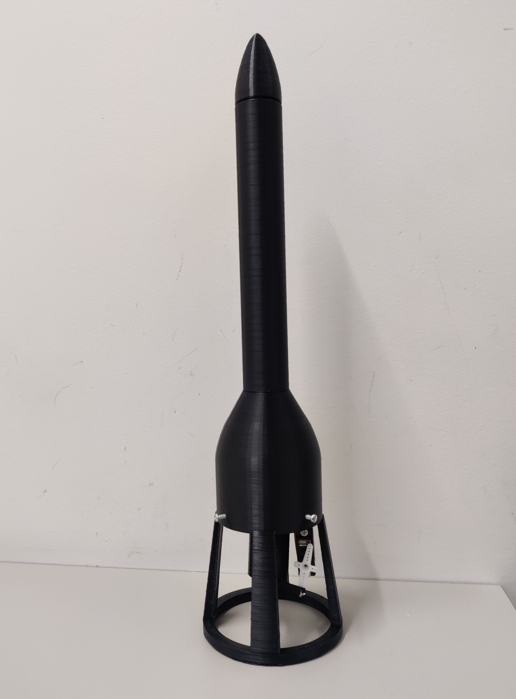

This folder contains the 3D model used to create the rocket gimbal, rocket body, nose cone and the rocket stand.

The 3D models were developed using a mixture of Solid Edge and Blender, with the files being exported as .stl for 3D printing.

All parts were printed using PLA filament, although other filaments may be preferable for increased strength. 

